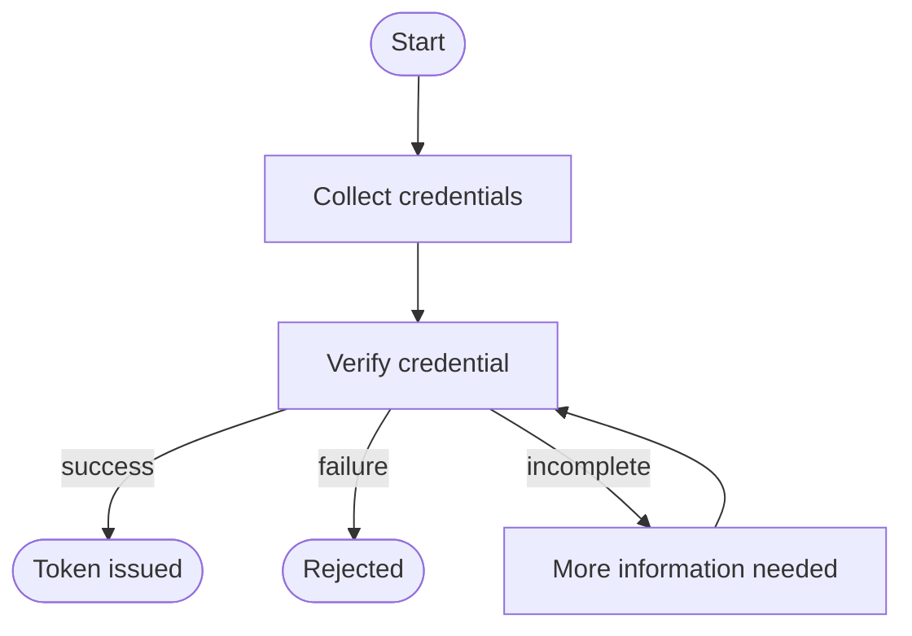

# Build the Sign-In Flows

The data is in place, but nothing yet carries a person from "not signed in" to holding a token. That is what flows do, and an application is what starts them. This page builds Wayfinder's two self-service journeys. The next page registers the app that runs them.

## Flows

None of the data defined so far does anything on its own. What turns it into a working sign-in is a flow: a sequence
of steps that carries a person from "not signed in" to holding a token with their role's permissions.

Each journey Wayfinder offers, such as sign-in or recovery, has its own flow. A flow's steps are screens that
collect input from the customer and the actions behind them, like verifying a credential or assigning a role.

<ProductName /> runs the matching flow the moment a customer starts one of these journeys.



The bundled `default-flow` already handles sign-in. Wayfinder builds a flow for each of its other journeys:

- To let customers register themselves, a registration flow collects a username and password, creates a `Customer`
  user, and assigns the `Traveler` role, so a new customer has full `booking:*` access from their first session.
- To restore lost access, a recovery flow identifies the customer by username, emails a recovery link, and lets them
  set a new password.
- To onboard internal staff, a staff onboarding flow lets an existing member invite a new one by email, and assigns
  the right staff role once the invitation is accepted.


Because a flow is built from steps, you can compose in more than a basic sign-in:

- **Several sign-in methods.** A flow can offer a choice, such as password or passkey, and let the customer pick
  which to use.
- **Multi-factor authentication.** A flow can require a second credential before it issues a token.
- **Consent.** A flow can pause to record what a customer agreed to, scoped to the permissions they approved, so you
  can check it later.

Each of these journeys has a step-by-step walkthrough in Wayfinder:
[Login](../try-it-out/add-login), [Self Sign-Up](../try-it-out/self-sign-up), and
[Account Recovery](../try-it-out/account-recovery). For the flow model itself, see
[Build a Flow](../../../guides/flows/build-a-flow).

## Build the Registration Flow

The registration flow drives [Self Sign-Up](../try-it-out/self-sign-up). It:

- Resolves the user type (prompts the new user to pick one if the application allows multiple).
- Prompts for username and password.
- Runs credentials-auth and provisioning, with `properties.assignRole` set to attach the `Traveler` role automatically.
- Prompts for any remaining required schema attributes (rendered dynamically from the user type).
- Returns an auth assertion so the new user lands signed in.

<Stepper stepNode="h3" as="h3">

### Create the registration flow

Save the JSON below as `wayfinder-registration-flow.json` and POST it to the flows API:

```bash
curl -k -X POST https://localhost:8090/flows \
  -H "Authorization: Bearer $TOKEN" \
  -H "Content-Type: application/json" \
  -d @wayfinder-registration-flow.json
```

<details>
<summary>wayfinder-registration-flow.json</summary>

```json
{
  "handle": "wayfinder-registration-flow",
  "name": "Wayfinder Registration Flow",
  "flowType": "REGISTRATION",
  "nodes": [
    { "id": "start", "type": "START", "onSuccess": "user_type_resolver" },
    {
      "id": "user_type_resolver",
      "type": "TASK_EXECUTION",
      "executor": { "name": "UserTypeResolver" },
      "onSuccess": "prompt_credentials",
      "onIncomplete": "prompt_usertype"
    },
    {
      "id": "prompt_usertype",
      "type": "PROMPT",
      "meta": {
        "components": [
          { "align": "center", "type": "TEXT", "id": "heading_usertype", "label": "Choose your account type", "variant": "HEADING_1" },
          {
            "type": "BLOCK",
            "id": "block_usertype",
            "components": [
              { "type": "SELECT", "id": "usertype_input", "ref": "userType", "label": "Account type", "placeholder": "Select an account type", "required": true, "options": [] },
              { "type": "ACTION", "id": "action_usertype", "label": "Continue", "variant": "PRIMARY", "eventType": "SUBMIT" }
            ]
          }
        ]
      },
      "prompts": [
        {
          "inputs": [ { "ref": "usertype_input", "identifier": "userType", "type": "SELECT", "required": true } ],
          "action": { "ref": "action_usertype", "nextNode": "user_type_resolver" }
        }
      ]
    },
    {
      "id": "prompt_credentials",
      "type": "PROMPT",
      "meta": {
        "components": [
          { "align": "center", "type": "TEXT", "id": "heading_credentials", "label": "Create your account", "variant": "HEADING_1" },
          {
            "type": "BLOCK",
            "id": "block_credentials",
            "components": [
              { "type": "TEXT_INPUT", "id": "input_username", "ref": "username", "label": "Username", "placeholder": "Pick a username", "required": true },
              { "type": "PASSWORD_INPUT", "id": "input_password", "ref": "password", "label": "Password", "placeholder": "Choose a password", "required": true },
              { "type": "ACTION", "id": "action_credentials", "label": "Continue", "variant": "PRIMARY", "eventType": "SUBMIT" }
            ]
          }
        ]
      },
      "prompts": [
        {
          "inputs": [
            { "ref": "input_username", "identifier": "username", "type": "TEXT_INPUT", "required": true },
            { "ref": "input_password", "identifier": "password", "type": "PASSWORD_INPUT", "required": true }
          ],
          "action": { "ref": "action_credentials", "nextNode": "credentials_auth" }
        }
      ]
    },
    {
      "id": "credentials_auth",
      "type": "TASK_EXECUTION",
      "executor": { "name": "CredentialsAuthExecutor" },
      "onSuccess": "provisioning"
    },
    {
      "id": "provisioning",
      "type": "TASK_EXECUTION",
      "properties": { "assignRole": "wayfinder-traveler-role" },
      "executor": {
        "name": "ProvisioningExecutor",
        "inputs": [
          { "ref": "input_username", "identifier": "username", "type": "TEXT_INPUT", "required": true },
          { "ref": "input_password", "identifier": "password", "type": "PASSWORD_INPUT", "required": true }
        ]
      },
      "onSuccess": "auth_assert",
      "onIncomplete": "prompt_schema_attrs"
    },
    {
      "id": "prompt_schema_attrs",
      "type": "PROMPT",
      "meta": {
        "components": [
          { "align": "center", "type": "TEXT", "id": "heading_schema_attrs", "label": "Tell us about you", "variant": "HEADING_1" },
          {
            "type": "BLOCK",
            "id": "block_dynamic_user_inputs",
            "components": [
              { "type": "DYNAMIC_INPUT_PLACEHOLDER", "id": "dynamic_inputs" },
              { "type": "ACTION", "id": "action_schema_attrs", "label": "Continue", "variant": "PRIMARY", "eventType": "SUBMIT" }
            ]
          }
        ]
      },
      "prompts": [
        { "inputs": [], "action": { "ref": "action_schema_attrs", "nextNode": "provisioning" } }
      ]
    },
    {
      "id": "auth_assert",
      "type": "TASK_EXECUTION",
      "executor": { "name": "AuthAssertExecutor" },
      "onSuccess": "end"
    },
    { "id": "end", "type": "END" }
  ]
}
```

</details>

Replace `wayfinder-traveler-role` with the ID of the `Traveler` role you created above if it differs.

See [Build a Flow](../../../guides/flows/build-a-flow).

</Stepper>

## Build the Account Recovery Flow

The recovery flow drives [Account Recovery](../try-it-out/account-recovery). It:

- Prompts the user for a username.
- Identifies the user.
- Generates a recovery token.
- Sends the recovery email.
- Verifies the token from the email link.
- Lands the user on a **Set new password** screen and updates the credential.

SMTP must be configured for the recovery email to reach the user. The SMTP step is covered in the [Set Up Account Recovery](../try-it-out/account-recovery/#set-up-account-recovery) and is required regardless of which path you took.

<Stepper stepNode="h3" as="h3">

### Create the recovery flow

Save the JSON below as `wayfinder-recovery-flow.json` and POST it to the flows API:

```bash
curl -k -X POST https://localhost:8090/flows \
  -H "Authorization: Bearer $TOKEN" \
  -H "Content-Type: application/json" \
  -d @wayfinder-recovery-flow.json
```

<details>
<summary>wayfinder-recovery-flow.json</summary>

```json
{
  "handle": "wayfinder-recovery-flow",
  "name": "Wayfinder Password Recovery Flow",
  "flowType": "RECOVERY",
  "nodes": [
    { "id": "start", "type": "START", "onSuccess": "prompt_username" },
    {
      "id": "prompt_username",
      "type": "PROMPT",
      "meta": {
        "components": [
          { "align": "center", "type": "TEXT", "id": "text_header_username", "label": "Reset your password", "variant": "HEADING_1" },
          { "type": "TEXT", "id": "text_subtitle_username", "label": "Enter your username and we'll email you a recovery link.", "variant": "HEADING_6" },
          {
            "type": "BLOCK",
            "id": "block_username",
            "components": [
              { "id": "input_username", "ref": "username", "type": "TEXT_INPUT", "label": "Username", "required": true, "placeholder": "Your username" },
              { "type": "ACTION", "id": "action_submit_username", "label": "Send recovery link", "variant": "PRIMARY", "eventType": "SUBMIT" }
            ]
          }
        ]
      },
      "prompts": [
        {
          "inputs": [ { "ref": "input_username", "identifier": "username", "type": "TEXT_INPUT", "required": true } ],
          "action": { "ref": "action_submit_username", "nextNode": "identify_user" }
        }
      ]
    },
    {
      "id": "identify_user",
      "type": "TASK_EXECUTION",
      "executor": {
        "name": "IdentifyingExecutor",
        "mode": "identify",
        "inputs": [ { "ref": "input_username", "identifier": "username", "type": "TEXT_INPUT", "required": true } ]
      },
      "onSuccess": "generate_recovery_token",
      "onFailure": "email_sent_status"
    },
    {
      "id": "generate_recovery_token",
      "type": "TASK_EXECUTION",
      "executor": { "name": "InviteExecutor", "mode": "generate" },
      "onSuccess": "send_recovery_email"
    },
    {
      "id": "send_recovery_email",
      "type": "TASK_EXECUTION",
      "properties": { "emailTemplate": "PASSWORD_RECOVERY" },
      "executor": { "name": "EmailExecutor", "mode": "send" },
      "onSuccess": "email_sent_status",
      "onFailure": "email_sent_status"
    },
    {
      "id": "email_sent_status",
      "type": "PROMPT",
      "meta": {
        "components": [
          { "align": "center", "type": "TEXT", "id": "email_sent_icon", "label": "✉️", "variant": "HEADING_1" },
          { "align": "center", "type": "TEXT", "id": "email_sent_heading", "label": "Check your email", "variant": "HEADING_1" },
          { "align": "center", "type": "TEXT", "id": "email_sent_message", "label": "If an account matches, we've sent a recovery link.", "variant": "HEADING_6" }
        ]
      },
      "message": "Check Your Email",
      "next": "verify_recovery_token"
    },
    {
      "id": "verify_recovery_token",
      "type": "TASK_EXECUTION",
      "executor": {
        "name": "InviteExecutor",
        "mode": "verify",
        "inputs": [ { "ref": "input_recovery_token", "identifier": "inviteToken", "type": "HIDDEN", "required": true } ]
      },
      "onSuccess": "prompt_new_password"
    },
    {
      "id": "prompt_new_password",
      "type": "PROMPT",
      "meta": {
        "components": [
          { "align": "center", "type": "TEXT", "id": "text_header_password", "label": "Set a new password", "variant": "HEADING_1" },
          {
            "type": "BLOCK",
            "id": "block_password",
            "components": [
              { "id": "input_new_password", "ref": "password", "type": "PASSWORD_INPUT", "label": "New password", "required": true, "placeholder": "New password" },
              { "type": "ACTION", "id": "action_submit_password", "label": "Update password", "variant": "PRIMARY", "eventType": "SUBMIT" }
            ]
          }
        ]
      },
      "prompts": [
        {
          "inputs": [ { "ref": "input_new_password", "identifier": "password", "type": "PASSWORD_INPUT", "required": true } ],
          "action": { "ref": "action_submit_password", "nextNode": "set_credential" }
        }
      ]
    },
    {
      "id": "set_credential",
      "type": "TASK_EXECUTION",
      "executor": { "name": "CredentialSetter" },
      "onSuccess": "recovery_complete"
    },
    {
      "id": "recovery_complete",
      "type": "PROMPT",
      "meta": {
        "components": [
          { "align": "center", "type": "TEXT", "id": "recovery_complete_icon", "label": "✅", "variant": "HEADING_1" },
          { "align": "center", "type": "TEXT", "id": "recovery_complete_heading", "label": "Password updated", "variant": "HEADING_1" },
          { "align": "center", "type": "TEXT", "id": "recovery_complete_message", "label": "Return to Wayfinder and sign in with your new password.", "variant": "HEADING_6" }
        ]
      },
      "message": "Password Reset Successful",
      "next": "end"
    },
    { "id": "end", "type": "END" }
  ]
}
```

</details>

See [Build a Flow](../../../guides/flows/build-a-flow).

</Stepper>
