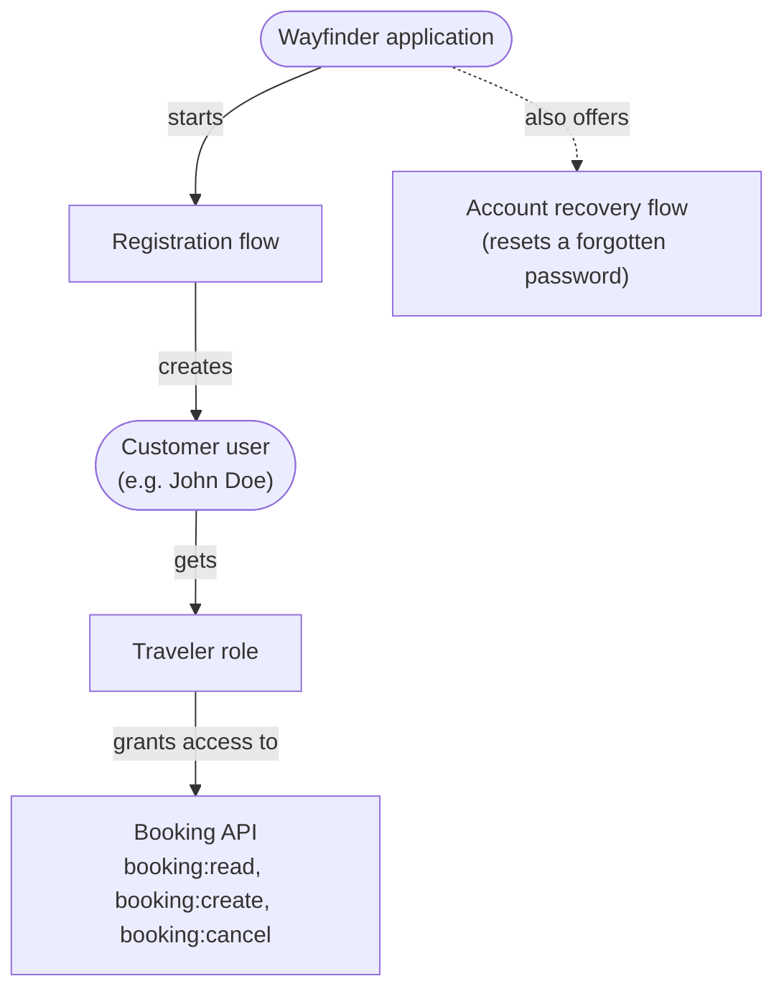
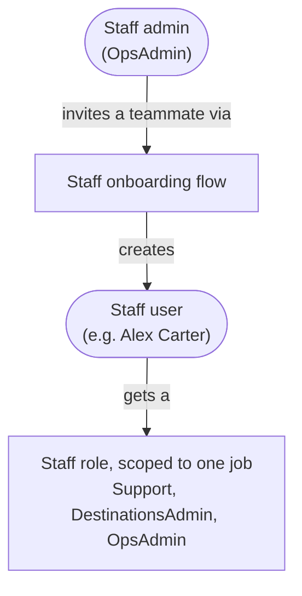

# What You Will Build

You will build the consumer access solution in <ProductName /> yourself, from an empty instance, using the Wayfinder
sample. Each page introduces one concept, then creates it, so you learn the model as you build it rather than before it.

Wayfinder serves two kinds of user, and each reaches the application a different way. Here is what you will build for
each, piece by piece.

Customers arrive on their own. They sign up, sign in, and recover access through the application, and come away able to
use the booking API:

Staff arrive by invitation. An admin brings each new member in, landing them with a role scoped to one job:

You will build it in order, each page picking up where the last left off:

1. **[Set Up Your Environment](../build-environment)** gets <ProductName /> and the sample running.
2. **[Model Your Users](../build-users)** defines the `Customer` and `Staff` user types and creates your first user.
3. **[Define Access](../build-access)** adds the booking resource server, its permissions, and the `Traveler` role.
4. **[Build the Sign-In Flows](../build-flows)** builds the registration and account-recovery journeys.
5. **[Register the Application](../build-application)** registers the OAuth2 client that runs them.
6. **[Onboard Internal Staff](../build-onboarding)** adds staff roles and an invitation flow.
7. **[How It All Runs](../build-run)** traces the finished solution across a single request.
