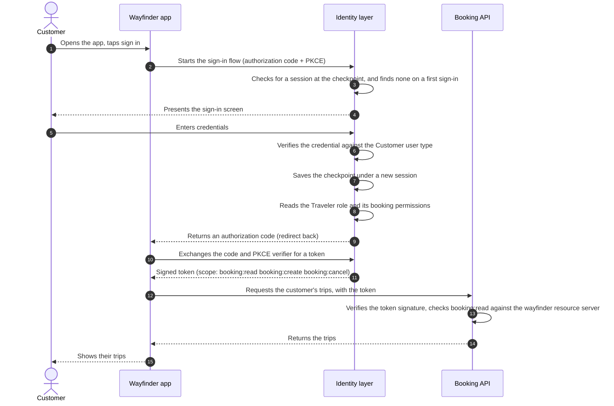

# How It All Runs

You have built every piece. On its own each one does little; together they carry a customer from opening the app to
an authorized API call, and your app never handles a credential or makes an access decision itself. Here is one
request passing through every piece you built:



## The Token

The token is the hinge. The identity layer mints it once, at sign-in, stamped with the permissions from the
customer's role. Every call after that is just the app presenting the token and the API reading it: no second trip to
the identity layer, no password anywhere near your backend. Decoded, it is an ordinary JSON Web Token (JWT), signed data your API can verify on its own:

```json
{
  "sub": "3f29a1d2-8b4e-4c7a-9f21-6e5d0a1b2c3d",
  "iss": "https://auth.example.com",
  "aud": "https://api.wayfinder.example.com",
  "scope": "booking:read booking:create booking:cancel",
  "exp": 1893456000
}
```

`sub` is the customer, `scope` is the permission list from their `Traveler` role, `aud` is the resource server the
token was issued for, and `iss` is the <ProductName /> instance that signed it. See
[Token Formats](../../../guides/protocols/oauth-oidc/token-formats) for the full set of claims (the fields inside the token).

That sequence runs in full only on a first sign-in. The session saved along the way shortens the next one, and every
application on the same flow reads it. [Sign Them Out Everywhere](../build-signout) shows how it unwinds.

## What You've Built

A complete consumer access solution, assembled by hand and running on standard OAuth2/OIDC:

- Customers sign themselves up, sign in, and recover their own accounts.
- Staff join by invitation, each scoped to a single job.
- A role decides what every customer may do, and the Booking API enforces it on every request.
- One sign-in opens every application you grouped together, and runs out on its own on two clocks.
- One sign-out ends it everywhere, even in applications the customer never went back to.
- Your application stores no passwords and makes no access decisions of its own. The identity layer and the token
  carry that weight.

## See It Live

[See It in a Sample App](../try-it-out) walks these same journeys in the running Wayfinder sample: sign in as John
Doe, sign up a new customer, recover a password, and onboard a staff member. When you want the reasoning behind the
defaults, and what to change when your
constraints differ, see [Design Decisions](../architecture-decisions).
