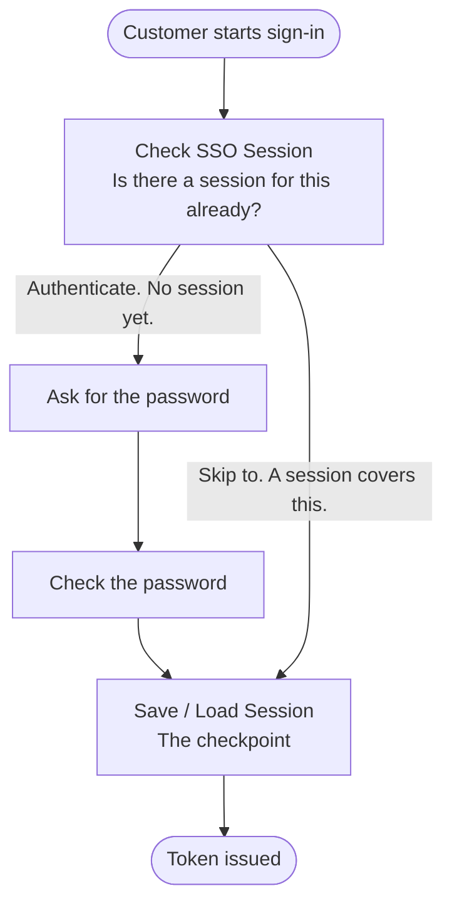

# Keep Them Signed In

Customers can sign in, but nothing remembers them. Every visit starts at an empty sign-in screen, even a visit that
began a minute ago in the same browser.

## Sessions

A **session** is a note <ProductName /> keeps after someone signs in. The note says who they are and what they proved.
Next time, <ProductName /> reads the note instead of asking again.

Two limits decide how long the note lasts:

| Limit | What it does | Default |
|---|---|---|
| Idle | Ends the session after this long with no activity. Each visit resets the clock. | 30 minutes |
| Absolute | Ends the session this long after it started, whatever the customer does. | 8 hours |

The first limit to run out wins, and then the customer signs in again. You set both once for the whole deployment. See
[Configure Session Lifetime](../../../guides/flows/single-sign-on#configure-session-lifetime).

The note stays on the server, and the browser only gets a cookie that points to it. So a customer who signs in on a
laptop is not signed in on their phone.

## Checkpoints

<ProductName /> needs to know which steps it may skip next time. You choose them with two nodes, the building blocks of
a flow:

- **Check SSO Session** asks whether a session already covers the next step. SSO is short for Single Sign-On.
- **Save / Load Session** is the checkpoint. It saves the result the first time, and loads it back later.

The steps between the two nodes are the ones a session can skip.

Where you put the nodes decides what a session is worth. Around the password step, a returning customer skips the
password. Keep a second factor outside them, such as a one-time code, and <ProductName /> asks for it every time.

## One Sign-In, Several Applications

The checkpoint belongs to the flow, not to the application that ran it. Two applications on the same flow share one
session, and two on different flows never do. That sharing is **Single Sign-On**, and there is nothing to switch on.

So the flow you pick is a security choice. Wayfinder is adding **Wayfinder Rewards**, a points page for the same
customers, and one sign-in for both is fine. A staff console that issues refunds is different. Put it on its own flow,
and a customer's session can never open it.

Add the checkpoint, then put a second application on the same flow:

<Stepper stepNode="h3" as="h3">

### Add the two nodes to the flow

Navigate to **Flows** and open **Wayfinder App Authentication Flow**. In the Flow Builder:

1. Add a **Check SSO Session** node after the start, before the password prompt. Connect its **Authenticate** outcome to
   that prompt.
2. Add a **Save / Load Session** node after the password check.
3. Connect the password check to it, and the **Skip to** outcome of **Check SSO Session** as well. Then carry on to the
   step that issues the token.

Both paths meet at one node, so the token comes out the same either way. Save the flow. See
[Single Sign-On for Flows](../../../guides/flows/single-sign-on).

### Register the Rewards application on the same flow

Navigate to **Applications** → **Add Application** and pick **Browser App**. Fill it in as you did in
[Register the Application](../build-application), naming it `WAYFINDER_REWARDS` with `http://localhost:5174` as its
redirect URI. Then open its **Flows** tab, select **Wayfinder App Authentication Flow** as the **Authentication Flow**,
and save.

That dropdown is the whole difference between one sign-in and two.

### Check that it works

Sign in to the booking application at <WayFinderSampleUrl /> as John (`john.doe` / `john.doe`) and leave the tab open.
Open the Rewards application in the same browser. It sends John to <ProductName />, finds his session, and brings him
back signed in. No password screen.

</Stepper>
