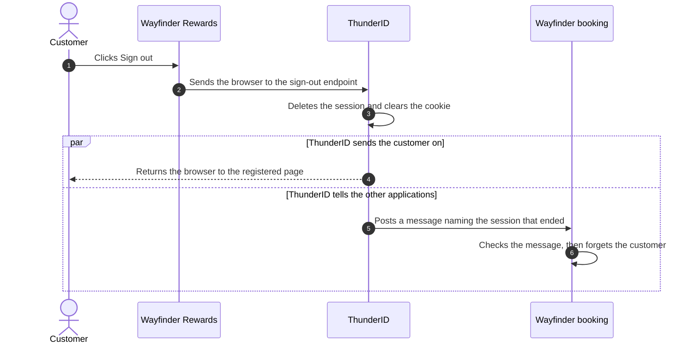

# Sign Them Out Everywhere

One sign-in now opens both Wayfinder applications. That is the point of it, and it is why signing out takes more than
one application forgetting the customer.

## Why Clearing One Application Is Not Enough

When a customer signs out, the application forgets them. The session does not go away. It is a note held by
<ProductName />, and the browser still has the cookie that points to it.

So the next click on **Sign in** reaches **Check SSO Session**, which finds that note. The flow takes the **Skip to**
path and hands out a token. Nobody typed a password.

A real sign-out needs two things: the application forgets the customer, and <ProductName /> deletes the note. Both get
called a session in everyday speech, which is why sign-out confuses people. On this page, "session" means the note
<ProductName /> holds.

## The Sign-Out Flow

Signing out is a journey, so <ProductName /> builds it as a flow. A **sign-out flow** deletes the note and clears the
cookie. Your application does not do this itself. It sends the customer to <ProductName />, which runs the flow and
sends them back to a page you registered beforehand.

Should you ask "are you sure?" first? That is your call, and there is a ready-made template for each answer:

- **Silent Sign Out** never asks.
- **Confirm & Sign Out** always asks.
- **Conditional Confirmation** asks only when the request arrives without the ID token from the original sign-in. Your
  application normally sends that token, so a request without it may not have come from your code.

An application finds its sign-out flow in the first of three places that names one: the application itself, its
organization unit, then the server-wide default. <ProductName /> ships a server-wide default, so an application that
sets nothing still signs customers out. See
[RP-Initiated Logout](../../../guides/protocols/oauth-oidc/rp-initiated-logout) for the request itself.

## Telling the Other Applications

Deleting the note stops the next sign-in from being silent. It does nothing to the *other* application. Rewards still
shows the customer their points after they signed out of the booking site.

<ProductName /> could tell Rewards through the browser, by loading it in a hidden frame on the way out. That breaks
when the customer closes the browser, when the browser blocks hidden frames, and when there is no browser at all
because an administrator ended the session or it timed out.

**Back-channel logout** skips the browser. Each application gives <ProductName /> an address, and when a session ends,
<ProductName /> sends a message straight to that address, server to server.

The two halves run side by side, so a slow application never makes the sign-out button feel slow.

The message is a **logout token**. <ProductName /> signs it with the same keys it uses for the tokens the application
already trusts, so the application can prove the message is genuine. It names the session that ended, not the person, so
a customer signed in on a laptop and a phone only loses the one that ended. It also carries a one-time number, so the
same message arriving twice is ignored.

<ProductName /> tells only the applications that used the session. One with no address set is skipped rather than
treated as an error, but it then keeps its own record of the customer, so set an address on every application that
shares a session. If an address is down or slow, the session still ends, the others are still told, and the failure is
written down.

Set up sign-out on both applications:

<Stepper stepNode="h3" as="h3">

### Create the sign-out flow

Navigate to **Flows** → **Add Flow** and pick **Sign Out** as the flow type. Choose the **Silent Sign Out** template,
name it `Wayfinder Sign Out Flow`, then save. Silent fits Wayfinder, where the customer clicked a button. See
[Build a Sign-Out Flow](../../../guides/flows/build-a-flow#go-further).

### Set up both applications

Navigate to **Applications** → **WAYFINDER** and set:

| Tab | Setting | Value |
|---|---|---|
| **Flows** | Sign Out Flow | `Wayfinder Sign Out Flow` |
| **OAuth / OIDC** | Post-logout redirect URIs | `http://localhost:5173` |
| **OAuth / OIDC** | Back-channel logout URI | `http://localhost:5173/backchannel-logout` |
| **OAuth / OIDC** | Back-channel logout session required | On |

Save, then do the same for **WAYFINDER_REWARDS** with `http://localhost:5174`.

The post-logout page must be on that list, or <ProductName /> rejects the request. The back-channel address has to be
one <ProductName /> can reach, which is not the same as one the browser can reach: in production it is a server address
on your own network, reached over TLS. The last setting adds the session name to the message, so leave it on.

### Handle the message in your application

This part is code in your own application, and the SDKs cover it where they can. The application checks the signature,
ignores a message it has seen before, and ends only the session the message names. It should reply quickly.

### Check that it works

Sign in to the booking application as John. Open Rewards in the same browser, then sign out of Rewards. Reload the
booking application. Once the notification has arrived, it shows its signed-out home page, and John never went back to
it. Click **Sign in** and
<ProductName /> asks for a password, because there is no note left to read.

</Stepper>
