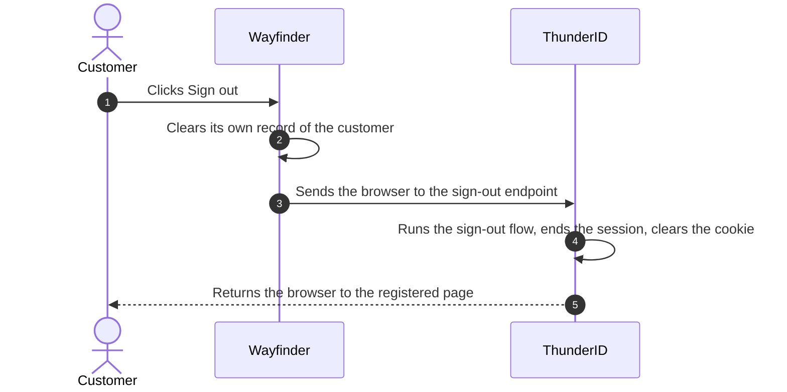

# Sign Them Out

Two systems remember the sign-in, and only one of them is yours.

Your application keeps its own record so it can render a signed-in page. <ProductName /> keeps a separate record of the
sign-in itself. Clearing the first leaves the second, so <ProductName /> still counts the customer as signed in. Both
get called a session in everyday speech, which is why sign-out confuses people. Here, "session" means the record
<ProductName /> holds.

## The Sign-Out Flow

A **sign-out flow** ends the session and clears the cookie that points to it. Your application does not run it. It
sends the customer to <ProductName />, which runs the flow and returns the browser to a page you registered
beforehand. OIDC calls this **RP-initiated logout**.

Whether to ask "are you sure?" first is your call, and there is a template for each answer:

- **Silent Sign Out** never asks.
- **Confirm & Sign Out** always asks.
- **Conditional Confirmation** asks only when the request arrives without the ID token from the original sign-in, which
  may mean it did not come from your code.

An application takes its sign-out flow from the first of three places that names one: the application, its organization
unit, then the server-wide default. <ProductName /> ships a server-wide default, so an application that sets nothing
still signs customers out. See
[RP-Initiated Logout](../../../guides/protocols/oauth-oidc/rp-initiated-logout).

<Stepper stepNode="h3" as="h3">

### Create the sign-out flow

Navigate to **Flows** → **Add Flow** and pick **Sign Out** as the flow type. Choose the **Silent Sign Out** template,
name it `Wayfinder Sign Out Flow`, then save. Silent fits Wayfinder, where the customer clicked a button. See
[Build a Sign-Out Flow](../../../guides/flows/build-a-flow#go-further).

### Point the application at it

Navigate to **Applications** → **WAYFINDER** and set:

| Tab          | Setting                   | Value                     |
| ------------ | ------------------------- | ------------------------- |
| **Flows**    | Sign Out Flow             | `Wayfinder Sign Out Flow` |
| **Advanced** | Post-Logout Redirect URIs | `{{WayFinderSampleUrl}}`  |

The page you return the customer to must be on that list, or <ProductName /> rejects the request.

### Sign out from your application

This part is code, and the SDKs cover it. Your **Sign out** button clears what the application remembers, then hands
the browser to <ProductName />, naming the ID token from the original sign-in and the page to come back to.

### Check that it works

Sign in to Wayfinder at <WayFinderSampleUrl /> as John (`john.doe` / `john.doe`), then select **Sign out**. The browser
goes to <ProductName /> and comes back signed out. Select **Sign in** and <ProductName /> asks for a password again.

</Stepper>
