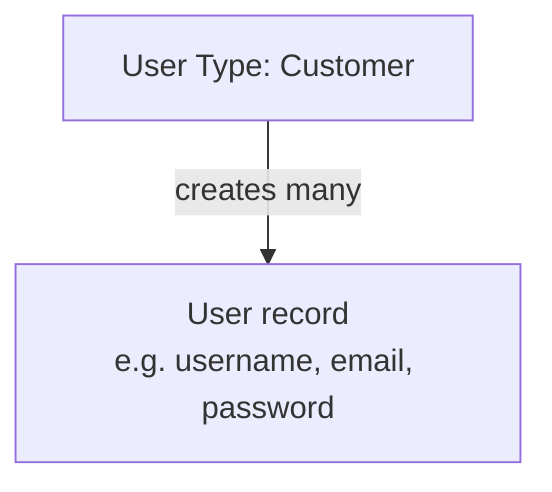

# Model Your Users

Everything starts with people. Before Wayfinder can sign anyone in, <ProductName /> needs to know what its users look like. This page defines the two kinds of user Wayfinder has, then creates a first customer to sign in with.

## User Types

Before anyone can sign up, <ProductName /> needs to know what a customer record looks like: which fields it has,
which are required, and which one holds a password. That definition is a user type, a schema for one category of
person (a template, not a person), and every user inherits exactly one. Wayfinder needs two, a `Customer` type and a
separate `Staff` type for the internal team; keeping them distinct keeps customer access separate from staff access
downstream.

See [User Types](../../../guides/users/user-types) for the attribute types, constraints, and credential options
a user type supports.

Create Wayfinder's two user types:

<Stepper stepNode="h3" as="h3">

### Create the `Customer` user type

Navigate to **User Types** → **Create User Type**. Define the schema:

| Attribute     | Type   | Properties          |
| ------------- | ------ | ------------------- |
| `username`    | string | Required, unique    |
| `email`       | string | Required, unique    |
| `password`    | string | Credential          |
| `given_name`  | string | Optional            |
| `family_name` | string | Optional            |
| `sub`         | string | Optional            |

See [User Types](../../../guides/users/user-types).

### Create the `Staff` user type

Navigate to **User Types** → **Create User Type**. Define the schema:

| Attribute     | Type   | Notes                            |
| ------------- | ------ | -------------------------------- |
| `username`    | string | Required, unique                 |
| `email`       | string | Required, unique                 |
| `password`    | string | Credential                       |
| `displayName` | string | Captured on invitation accept    |

See [User Types](../../../guides/users/user-types).

</Stepper>

## Users

Those two types are still just templates. Wayfinder's actual people are users: real records that conform to a
type, each one holding a real person's username, email, and credential.

The two types fill up in opposite ways. `Customer` users mostly aren't created by hand; each one appears the moment
someone completes the app's sign-up flow, which is why a consumer product can grow to millions of them without anyone
provisioning accounts. The first `Staff` user, by contrast, is created directly, so at least one person exists to
start inviting the rest of the team in.

See [Manage Users](../../../guides/users/manage-users).

Create the first customer by hand so you have someone to sign in with (later ones arrive through the registration flow):

<Stepper stepNode="h3" as="h3">

### Create John Doe as a `Customer`

Navigate to **Users** → **Add User**. Select `Customer` as the user type and click **Create User**. Fill in the schema attributes (`username: john.doe`, `email: john.doe@example.com`, password: `john.doe`) and complete the user creation.

</Stepper>
