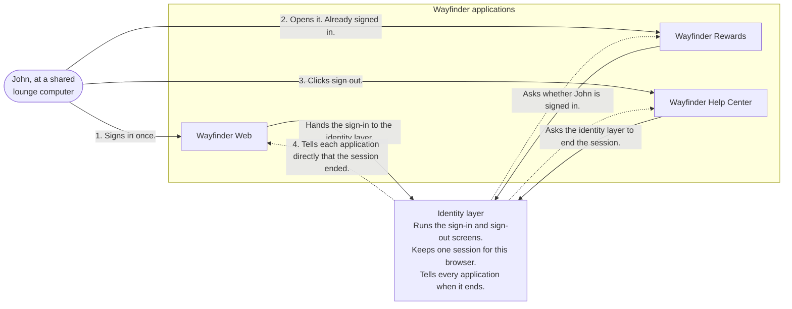

# Overview

John Doe, the returning traveller from the [consumer access story](../overview), is waiting for a flight in the
Skyline Lounge. Wayfinder has grown into three applications he uses in one sitting: the booking site, Wayfinder Web,
where he checks his flight; Wayfinder Rewards, where he looks up his Gold tier points; and the Wayfinder Help Center,
where he changes his seat. He does all of it on a shared computer in the lounge. When his flight is called, he clicks
**Sign out** in the Help Center and walks to the gate.

To John, that was one sign-in and one sign-out. Behind the scenes, every one of those applications had to answer the
same questions:

- Has this person already signed in somewhere we trust, or do we ask again?
- How long should that sign-in stay good for?
- When he signs out of one application, which others need to know?
- What if he never clicks sign out at all?

Handling those questions is what it takes to make "sign in once, sign out everywhere" true. The sign-in screen is the
part John sees. The rest is bookkeeping about who is signed in where, and that is the part that goes wrong.

:::note About the Applications in This Story
The Wayfinder sample ships the booking site, Wayfinder Web. The rewards site, the help center, and the payments page
appear in this story to show what happens when more than one application shares a sign-in. They stand in for whatever
second and third applications your own product grows.
:::

## The Problem

Every application starts out keeping its own record of who signed in. That works for one application and breaks as
soon as there are two:

- **Signing in again and again.** Each application only knows about its own sign-in, so John types his password three
  times in one visit. Every new application Wayfinder adds makes it one worse.
- **A sign-out that only half works.** Clicking **Sign out** in the Help Center clears the Help Center. Wayfinder Web
  and Wayfinder Rewards still believe he is there. On a shared computer, the next person to sit down inherits his
  bookings and his points.
- **Applications that are never told.** Even with one central place that ends the sign-in, each application only finds
  out if something carries the message to it. Leaving that to the browser is fragile: it fails when the browser is
  closed, when the browser blocks the hidden pages or cookies the message rides on, or when no browser was involved at
  all.
- **Sign-outs that nobody clicked.** A laptop is lost, an account is closed, or a session should end after a quiet
  afternoon. These endings happen without John doing anything, and they still have to reach every application.
- **Different levels of trust.** A sign-in that was good enough to check points should not, on its own, open the
  payments page where his cards are saved. Some applications must ask again, and that has to be a deliberate choice
  rather than an accident.

## How It Works

Solving this means moving the record of who is signed in out of the applications and into one shared place.
<ProductName /> is that place: the **identity layer**, the one system that handles signing in and signing out for every
application. When John signs in, <ProductName /> creates a **session**, a record that this person signed in, in this
browser, at this time. The applications do not keep their own copy of that record. Each one asks <ProductName />
instead.

The diagram shows John's afternoon with the identity layer in the middle.

Three things happen in that picture, and together they are the whole pattern:

- **Sign in once.** Wayfinder Web hands John to <ProductName /> to sign in. <ProductName /> checks his password, starts
  a session, and sends him back with a **signed token**, a small signed message that tells the site who he is.
- **Already signed in.** Wayfinder Rewards also hands him to <ProductName />, which finds the session and sends him
  straight back. He never sees a sign-in screen. This is **single sign-on** (SSO): one sign-in, reused by every
  application that shares it.
- **Sign out everywhere.** The Help Center asks <ProductName /> to end the session. <ProductName /> ends it, then tells
  Wayfinder Web and Wayfinder Rewards directly, over its own connection to each of them, that the session is over. That
  message never travels through John's browser, so it still arrives if the browser is already closed. This is
  **back-channel logout**.

The one idea to hold on to: the session lives in <ProductName />, not in the applications. Applications borrow it while
it lasts, and they are told when it ends.

:::tip Not Your Pattern?
- If each of your customers is a separate organization with its own users and settings, see
  [Multi-Tenant SaaS Identity](../../b2b/multi-tenant-saas).
:::

None of this needs custom code in each application. Signing out and back-channel logout follow the
[OpenID Connect](../../../guides/protocols/oauth-oidc/openid-connect) standards, so an application built with any
standard OpenID Connect library can join a session, sign out, and receive the sign-out message the same way it would
with any other identity layer.

## Next Steps

The rest of this part follows John through each step:

1. [Sign In Once for Every Application](../sessions-sign-in-once) follows his first sign-in, the second application that lets
   him straight in, and how long the session lasts.
2. [Sign Out](../sessions-sign-out) follows the **Sign out** click, and why the application and <ProductName /> both have to take
   part.
3. [Sign Out Everywhere](../sessions-sign-out-everywhere) follows the message to the other applications, including the cases
   where the browser is closed or nobody clicked at all.
4. [Session and Sign-Out Decisions](../sessions-decisions) covers the choices behind this shape: which applications share a
   sign-in, how long it lasts, and what to do when a message cannot be delivered.
