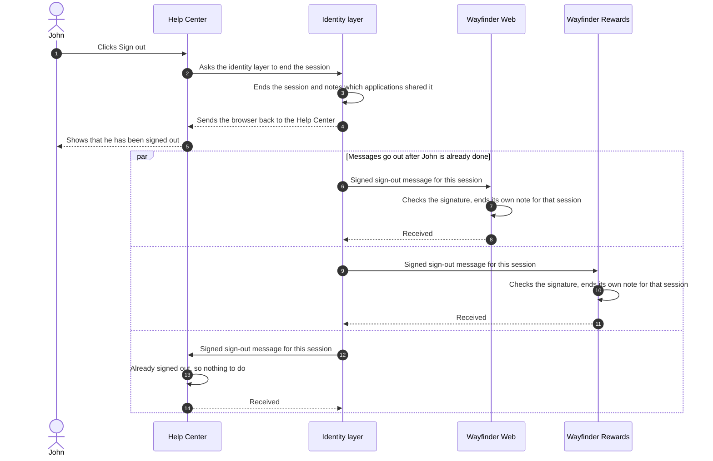

# Sign Out Everywhere

When John signed out of the Help Center, the session in <ProductName /> ended. Wayfinder Web and Wayfinder Rewards were
not part of that click. Each still holds its own note that John is signed in, and each keeps trusting that note until
it expires. **Back-channel logout** is how <ProductName /> closes that gap: when a session ends, <ProductName /> sends a
signed message to every application that shared it, directly from its own servers to theirs, with no help from John's
browser.

The diagram follows the session ending and the messages that go out afterwards.



The rest of this page walks through the situations Wayfinder cares about, one at a time.

## Signing Out of One Signs Out of All

John signs out of the Help Center. <ProductName /> ends the session, then sends a sign-out message to every application
that took part in it and gave <ProductName /> an address for such messages: Wayfinder Web, Wayfinder Rewards, and the
Help Center itself. Each application ends its own note for that session. The Help Center had already cleared its note
when John clicked, so it ignores the message, which is expected.

Only applications that shared the session are told. John's phone session, from a different browser, is a different
session, and nothing happens to it.

## The Browser Is Already Closed

John clicks **Sign out**, closes the browser before the signed-out page finishes loading, and heads for the gate. The
messages to Wayfinder Web and Wayfinder Rewards still arrive, because they never used his browser. <ProductName />
sends them from its own servers after the session has ended, and John's part in the sign-out was over the moment the
session ended.

This is the difference from older sign-out designs that had the browser load a hidden page for each application. Those
stop working when the browser is closed, when the browser blocks hidden pages or third-party cookies, or when there
was never a browser at all. The back channel depends on none of that.

## Nobody Clicked Sign Out

Not every session ends with a click. Alex Carter, the operations admin, can end every session a person has, for
example when the person's account is deleted. That happens on Alex's side, with no browser of John's involved.
<ProductName /> treats it the same way as a click: the session ends, and the sign-out messages go out to every
application that shared it.

One ending is different. When a session runs out of time, no message is sent. Each application's own note has its own
time limit and expires on its own. If that matters for an application, keep its own limit short.
[Session and Sign-Out Decisions](../sessions-decisions) covers that choice.

## Only the Right Session Ends

John is signed in to Wayfinder Web on the lounge computer and, separately, on his phone. When he signs out at the lounge
computer, only that session should end. The phone should stay signed in.

Every sign-out message names the session it is about. Each application received that same session name when John
signed in, tucked inside the signed token, so it can match the message to the right note and leave the others alone.
Wayfinder Web ends John's lounge-computer session and keeps his phone signed in. An application can tell
<ProductName /> that it needs the session name in every message it receives.

## An Application Cannot Be Reached

Wayfinder Rewards is down for maintenance when John signs out. <ProductName /> ends his session anyway, tells Wayfinder
Web anyway, and never delays or fails John's sign-out because of the rewards site. His browser was sent back to the
Help Center before any message went out.

For Wayfinder Rewards, <ProductName /> tries again a few times, waiting a little longer each time. If it still cannot
get through, it records that the message was not delivered and moves on. Every attempt is recorded, whether it
succeeded or failed, so Alex can later see which applications were told and which were not. The record never contains
the message itself or anything about John beyond the identifiers needed to find the session.

## How an Application Knows the Message Is Genuine

A message that says "sign this person out" must not be something anyone can forge. Three things protect it:

- **It is signed by <ProductName />.** The message is signed with the same keys <ProductName /> uses for sign-in tokens,
  and every application already knows how to check those keys. A message that does not check out is thrown away.
- **It is addressed to one application.** Each application gets its own message, naming that application. A message
  meant for Wayfinder Web is not accepted by Wayfinder Rewards.
- **It cannot be replayed.** Every message carries a unique number and expires within minutes. An application remembers
  the numbers it has seen and rejects a copy.

Because the message follows the OpenID Connect Back-Channel Logout standard, an application built with a standard
library checks all of this without custom code.

<details>
<summary>What the message looks like</summary>

For the technical reader, the message is a signed **logout token**, delivered as a `POST` to the address the
application registered, with the token in the request body. Decoded, the copy sent to Wayfinder Web looks like this:

```json
{
  "iss": "https://auth.wayfinder.example",
  "aud": "wayfinder-web",
  "iat": 1893456000,
  "exp": 1893456120,
  "jti": "0a1b2c3d-4e5f-4a6b-8c7d-9e0f1a2b3c4d",
  "sub": "3f29a1d2-8b4e-4c7a-9f21-6e5d0a1b2c3d",
  "sid": "01930c7e-2f4a-7b3c-9d1e-5a6b7c8d9e0f",
  "events": {
    "http://schemas.openid.net/event/backchannel-logout": {}
  }
}
```

`iss` is the <ProductName /> instance that signed it, `aud` is the application it is for, `sub` is John, and `sid` is
the session that ended. `jti` is the unique number that stops replays, and `exp` is when the message expires. The
`events` entry marks it as a sign-out message rather than a sign-in token, so one can never be mistaken for the other.
`sub` is the same value that identifies John in the [access token](../build-run#the-token) Wayfinder Web already
holds.

</details>

## Setting It Up

Each application tells <ProductName /> where to send its sign-out messages. Alex does this in the Console, on the
application's settings page, in the same section as the page the application returns people to after sign-out:

- **Back-Channel Logout URI** is the address <ProductName /> sends the message to. It must be a full `https` address.
  Leave it empty for an application that should not receive messages, and <ProductName /> skips that application
  without treating it as an error.
- **Require session identifier** asks <ProductName /> to always name the session in the message, so the application can
  end exactly one session. It can only be turned on once an address is set.

The same two settings are available through the management API and in declarative configuration, and an application
that registers itself through
[Dynamic Client Registration](../../../guides/protocols/oauth-oidc/dynamic-client-registration) can send them with
its registration. Whichever path is used, an invalid address is rejected the same way.

<ProductName /> also announces that it supports back-channel logout in its published
[server metadata](../../../guides/protocols/oauth-oidc/server-metadata), so an application built with a standard
OpenID Connect library turns the feature on by itself once it has an address. An operator can turn back-channel
delivery off for the whole deployment. The registered addresses stay in place, unused, until it is turned on again.

## Next Steps

- [Session and Sign-Out Decisions](../sessions-decisions) covers which applications should register an address, how short to
  keep each application's own sign-in, and what the delivery records are for.
- [RP-Initiated Logout](../../../guides/protocols/oauth-oidc/rp-initiated-logout) is the sign-out request that,
  together with back-channel logout, makes sign out everywhere work for browser-based applications.
