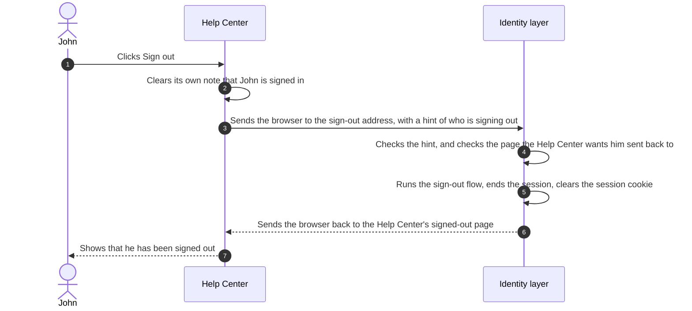

# Sign Out

John's flight is called. He clicks **Sign out** in the Wayfinder Help Center. That click has to do two separate things,
and if either one is missed he is not really signed out.

## Two Places to Sign Out Of

The Help Center keeps a small note of its own that says John is signed in here, so it does not have to ask
<ProductName /> on every page he opens. The session that started it all lives in <ProductName />. Signing out means
clearing both:

- **The application's own note.** The Help Center clears it when John clicks **Sign out**. If it stopped there, the
  session in <ProductName /> would still be alive. The next time John, or whoever sits down next, opened the Help
  Center, it would send the browser to <ProductName />, find the session, and let them straight in without a password.
  John would appear to be signed out and would not be.
- **The session in <ProductName />.** The Help Center asks <ProductName /> to end it. Once it is gone, the next visit to
  any application that shared it asks for a password again.

This is why an application cannot sign a person out by itself. It has to ask <ProductName /> too.

## What Happens When He Clicks

The diagram follows the click from the Help Center to the identity layer and back.



In words:

1. The Help Center clears its own note.
2. It sends John's browser to the <ProductName /> sign-out address, along with a hint of who is signing out (the signed
   token it received when he signed in) and the page it wants him returned to.
3. <ProductName /> checks the hint, and checks that the return page is one the Help Center registered in advance. A
   return page that was not registered is refused, so nobody can use the sign-out address to send a person to a
   look-alike site.
4. <ProductName /> runs the application's **sign-out flow**. Every application has one, and by default it ends the
   session at once without asking anything. If Wayfinder prefers an "Are you sure you want to sign out?" screen, it can
   choose a flow that asks every time, or one that asks only when the hint is missing.
5. <ProductName /> ends the session and clears the session cookie from the browser.
6. The browser lands on the Help Center's signed-out page.

From this moment, opening Wayfinder Web or Wayfinder Rewards in that browser and going through sign-in asks for a
password again. The session that let them skip it is gone.

## What Has Not Happened Yet

John ended the session, but Wayfinder Web and Wayfinder Rewards still hold their own notes that he is signed in. Nothing
on this page told them anything. If John left Wayfinder Web open in another tab, it may still show his bookings until
its own note expires, because it has not been back to <ProductName /> to ask. Closing that gap, without depending on
John's browser, is what [Sign Out Everywhere](../sessions-sign-out-everywhere) is about.

## Applications That Draw Their Own Screens

Some applications never send the browser to <ProductName />. They draw their own sign-in screens and talk to
<ProductName /> directly, the [app-native pattern](../integration-patterns#app-native). Those applications run the
same sign-out flow through the <ProductName /> API instead of the sign-out address, and the result is the same: the
session ends. See [Build a Sign-Out Flow](../../../guides/flows/build-a-flow#go-further).

## What the Sign-Out Request Looks Like

For the technical reader, the "sends the browser to the sign-out address" step in the diagram is one web address. The
Help Center sends John's browser here:

```http
GET /oauth2/logout
  ?id_token_hint=$ID_TOKEN
  &post_logout_redirect_uri=https://help.wayfinder.example/signed-out
  &state=xyz
```

- `id_token_hint` is the hint: the signed token the Help Center received at sign-in, which tells <ProductName /> which
  application and which person this is.
- `post_logout_redirect_uri` is the return page, which must match one registered on the application.
- `state` is a value the Help Center can use to recognize the return.

<ProductName /> ends the session and sends the browser to `https://help.wayfinder.example/signed-out?state=xyz`. Every
parameter, the validation rules, and the confirmation options are in
[RP-Initiated Logout](../../../guides/protocols/oauth-oidc/rp-initiated-logout).

## Next Steps

- [Sign Out Everywhere](../sessions-sign-out-everywhere) follows the message from <ProductName /> to the applications that were
  not part of the click.
- [Session and Sign-Out Decisions](../sessions-decisions) covers whether to ask for confirmation, and which sign-out path fits
  each kind of application.
