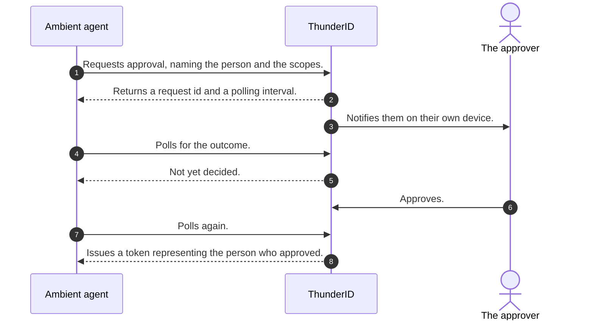

# The Person Is Not There to Approve

An agent [acting on behalf of a user](../solve-acts-for-user) needs that person present to approve. An **ambient
agent** does not work that way. It runs on a schedule, wakes on an event, or works through a queue, and there is
nobody in front of it when it runs.

Most of what an ambient agent does needs nobody's permission, and its own token covers that. The problem is the
one step in the middle that does. A reconciliation agent finds a payment above its threshold. A support agent
reaches a refund that needs a person to agree. There is no browser to redirect to, so the agent either stops
and waits for somebody to notice, or carries on without the approval it should have obtained. Neither is
acceptable, and the second is worse for being invisible.

## Approval Through the Back Channel

<ProductName /> answers this with **backchannel authorization**, specified as OpenID Connect Client-Initiated
Backchannel Authentication and usually shortened to CIBA. It separates the approval from the agent's own
execution: the agent asks for a decision, the person makes it on their own device, and the agent picks up the
result whenever it arrives.

The agent starts by naming the person it needs approval from, using `login_hint` or `id_token_hint`, along with
the scopes it wants and optionally the API the token should be bound to. It can also send a
`binding_message`, a short line shown to the person so they can tell what they are approving.

<ProductName /> notifies that person, and hands the agent back a request identifier with a polling interval and
an expiry.

## Polling for the Outcome

The agent polls the token endpoint with the CIBA grant until the person acts. <ProductName /> supports poll
mode, so the agent asks rather than being called back, which suits a background worker that may not hold an
open listener.

Four outcomes are worth handling explicitly, and they map to what your agent should actually do:

- **Still waiting.** Keep polling at the interval you were given, which defaults to five seconds.
- **Polling too fast.** Increase the interval by five seconds and keep it there.
- **The request expired.** Nobody acted in time, so start over or give up.
- **Refused.** The person said no, which is an answer and not an error to retry around.

The request identifier is consumed the first time it produces a token, so a later poll on the same identifier
fails rather than issuing a second one.

What comes back is a token that represents the person who approved. The service that receives it applies their
permissions, the same as it would for a token obtained through a browser sign-in. The difference is in how the
approval was collected, not in what the agent can then do.

See [Backchannel Authentication (CIBA)](../../../guides/protocols/oauth-oidc/backchannel-authentication) for
the request, the polling loop, and the full error reference, and
[Get a token for the user](../../../guides/agents/authentication/on-behalf-of-user#get-a-token-for-the-user)
for how this sits alongside the other two ways an agent gets a token for somebody.

:::note Where to see it running
The playground's tabs all sign a present user in, so they do not cover this path. The
[Wayfinder sample](../try-it-out) does: its upgrade agent holds the CIBA grant and emails the customer when a
seat upgrade needs their approval.
:::
