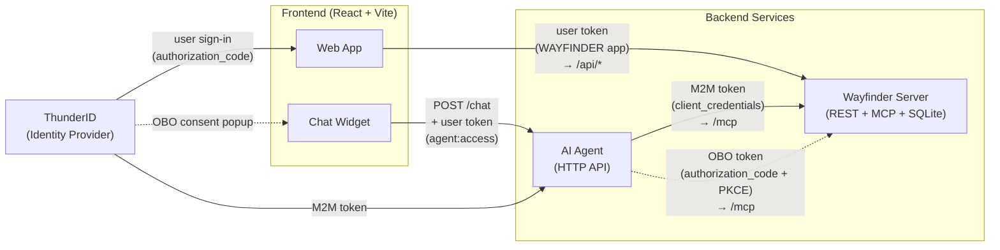

# Wayfinder Sample

End-to-end sample of an AI agent that holds its own ThunderID-managed identity.

The agent uses **its own access token (client_credentials grant)** for browsing tools. When a tool needs the user's consent (booking, cancellation, reading the user's own data), it switches to a **user-context token**. That token is obtained via **OAuth 2.0 authorization-code + PKCE**.

The sample is a travel booking app called Wayfinder. A chat widget in the UI talks to a LangChain agent that calls REST tools through an MCP server. The REST API and the MCP server share one Node process and one set of service modules. `/api/*` is the REST surface and `/mcp` is the MCP surface, both enforcing the same `booking:*` scopes against Thunder-issued tokens.

## Architecture



### Token Flow

The sample uses two OAuth clients and three token types:

| Token | OAuth Client | Grant | Purpose |
|-------|-------------|-------|---------|
| **User token** | `WAYFINDER` | `authorization_code` | Frontend sign-in, API calls, chat API auth (`agent:access` scope) |
| **M2M token** | `WAYFINDER-CONCIERGE` | `client_credentials` | Agent's own identity for browsing tools (search flights, hotels) via MCP |
| **OBO token** | `WAYFINDER-CONCIERGE` | `authorization_code` + PKCE | User-context token for mutating tools (booking, cancellation) via MCP |

**How it works:**

1. The user signs in to the Wayfinder web app via the `WAYFINDER` OAuth application. The issued token carries `agent:access` (from the Chat User role).
2. When the user sends a chat message, the frontend calls `POST /chat` on the AI Agent API with the user's access token in the `Authorization` header. The AI Agent validates the token has the `agent:access` scope before processing the message.
3. For browsing tools (search flights, search hotels), the AI Agent uses its own M2M token (obtained via `client_credentials` with the `WAYFINDER-CONCIERGE` credentials) to call the Wayfinder server's `/mcp` endpoint.
4. For mutating tools (create booking, cancel booking), the AI Agent returns a `need_user_consent` response. The frontend opens a consent popup, the user signs in and picks which booking permissions to grant (`booking:read`, `booking:create`, `booking:cancel`), and the authorization code is submitted to `POST /chat/consent`. The agent exchanges it for a user-context token, and the frontend retries the original message.
5. The Wayfinder server validates the JWT on every request and enforces scopes per route — browsing endpoints/tools are open, booking endpoints/tools require the matching `booking:*` scope. The MCP layer and the REST layer share the same scope guards because they share the same service modules.

## What This Demonstrates

- A ThunderID **agent** acting as an autonomous principal — distinct from a ThunderID user.
- The agent's **machine-to-machine (M2M) token** used for read-only browsing tools (search flights, search hotels, recommend flights, etc.).
- **Scope-based access control** on the AI Agent's HTTP API — only users with `agent:access` can use the chat. Users without this scope (e.g. `jane.smith`) can browse and book through the UI but cannot use the Wayfinder Concierge.
- A **typed user model** — `Customer` user type for consumers, `Staff` user type for internal team — with self sign-up, password recovery, and staff invitation flows backing the B2C use-case story.
- An **on-behalf-of (OBO)** flow triggered from inside a chat session: the agent returns a consent request, the frontend opens a popup where the user picks which booking permissions to grant, and the issued user-context token only carries the approved subset.
- A REST API that **verifies the JWT** and **enforces scopes per route** (`booking:read`, `booking:create`, `booking:cancel`, `booking:recommend`).
- A **self-service profile page** at `/profile` that calls Thunder's `/users/me` directly with the `WAYFINDER` user token to read account details, edit attributes, and change the password.
- **Multi-LLM support** — the Wayfinder Concierge works with both **Anthropic Claude** and **Google Gemini**, selectable via an environment variable.

## Auth Modes

The sample supports three auth modes, toggled via environment variables in `frontend/.env`:

| Mode | `VITE_AUTH_IS_REDIRECT_BASED` | `VITE_AUTH_IS_VERBOSE` | Description |
|------|-------------------------------|------------------------|-------------|
| **Redirect** | `true` | — | Standard OAuth2 authorization-code + PKCE. Users are redirected to the ThunderID Login Gate for sign-in, recovery, and sign-up. |
| **App-native** | `false` | `false` | Embedded step-by-step flow. The app drives the `/flow/execute` loop directly and renders its own forms from the server's `inputs[]`/`actions[]` arrays. |
| **App-native verbose** | `false` | `true` | Same as app-native, but the ThunderID SDK orchestrates the flow loop and exposes component trees; the app renders custom UI from those trees. |

Pass `--redirect-based` or `--verbose` flags to `start.sh` to override the `.env` values at startup (see [Run](#run) below).

## ThunderID Config Bundles

Two config bundles are provided under `thunderid-config/`, one for each auth mode family:

| Folder | Use with | Registration flow | Recovery `inviteBaseURL` |
|--------|----------|-------------------|--------------------------|
| `thunderid-config/redirect/` | Redirect mode | `wayfinder-registration-flow` (standard sign-up, redirects to Login Gate) | Not set — Login Gate handles the recovery link |
| `thunderid-config/app-native/` | App-native modes | `wayfinder-registration-autosignin-flow` (embedded sign-up with auto sign-in) | `http://localhost:5173/recovery` — links open the in-app recovery page |

Import the bundle matching your intended mode: upload the folder's `thunderid-config.yaml` along with its `thunderid.env` from the ThunderID Console welcome screen.

## Project Structure

```text
wayfinder-sample/
├── frontend/           React + Vite UI. Hosts the chat widget and the
│                       /agent-callback route used by the consent popup.
├── backend/            Node server backed by SQLite. Hosts both the REST API
│                       (/api/*) and the MCP server (/mcp), validates JWTs,
│                       enforces scopes per route and per MCP tool.
├── ai-agent/           HTTP Wayfinder Concierge API (LangChain + Claude/Gemini).
├── thunderid-config/
│   ├── redirect/       ThunderID config + env for redirect-based auth mode.
│   └── app-native/     ThunderID config + env for app-native auth modes.
└── README.md
```

Each subdirectory has its own README with the environment variables it reads and a `npm start` command.

## Prerequisites

- Node.js 20+
- A running ThunderID backend on `https://localhost:8090` (self-signed cert is fine).
- **One** of the following LLM API keys:
  - Anthropic API key from [console.anthropic.com](https://console.anthropic.com), **or**
  - Google Gemini API key from [aistudio.google.com](https://aistudio.google.com).

### Allow the frontend origin in Thunder

The Wayfinder web app runs on `http://localhost:5173` and calls Thunder directly for `/oauth2/authorize`, `/oauth2/token`, and `/users/me`. Browsers block these cross-origin calls unless Thunder's CORS allow-list includes the frontend origin.

Edit `backend/cmd/server/repository/conf/deployment.yaml` and add `http://localhost:5173` under `cors.allowed_origins`. Leave any existing entries in place — they belong to other samples.

```yaml
cors:
  allowed_origins:
    # ...existing entries...
    - "http://localhost:5173"
```

Restart the ThunderID server after the change. If you serve the frontend from a different host or port, add that origin instead.

## ThunderID Setup

The `thunderid-config/` directory contains two importable bundles — one for redirect mode and one for app-native modes. Pick the folder that matches your intended auth mode.

### Import Resources

1. Start ThunderID and open the Console.
2. On the **welcome screen** (shown on first login, or accessible from the user profile menu), choose **Open** and upload the `thunderid-config.yaml` from your chosen folder (`redirect/` or `app-native/`). Then upload the `thunderid.env` from the same folder.

The import creates:

| Resource | Type | What it creates |
|----------|------|-----------------|
| `Customer` | User type | Consumer schema (`username`, `email`, `password`, `given_name`, `family_name`, `sub`) with self-registration enabled |
| `Staff` | User type | Internal team schema (`username`, `email`, `password`, `displayName`) |
| `wayfinder-agent` | Resource server | `agent:access` permission |
| `wayfinder-booking` | Resource server | `booking:read`, `booking:create`, `booking:cancel`, `booking:recommend` permissions. Protects both `/api/*` (REST) and `/mcp` (MCP tools) on the Wayfinder server. |
| `WAYFINDER` | Application | Public OAuth app (PKCE, redirect to `http://localhost:5173`) with registration and recovery flows enabled |
| `WAYFINDER-CONCIERGE` | Agent | Confidential OAuth client with `client_credentials` + `authorization_code` grants |
| `wayfinder-registration-flow` | Flow | Self sign-up flow (REGISTRATION). Assigns the `Traveler` role on completion. |
| `wayfinder-recovery-flow` | Flow | Email-link password recovery flow (RECOVERY) |
| `wayfinder-onboarding-flow` | Flow | Staff onboarding flow (USER_ONBOARDING) with Support/DestinationsAdmin role-selection branches |
| `wayfinder-agent-auth-flow` | Flow | Authentication flow with consent screen (assigned to the AI chat agent) |
| `Traveler` | Role | Booking permissions, assigned to `john.doe` and `jane.smith` |
| `Support` | Role | Staff role for consumer support workflows |
| `DestinationsAdmin` | Role | Staff role for curating featured destinations |
| `OpsAdmin` | Role | Staff role for managing other staff, assigned to `alex.carter` |
| `Wayfinder Chat User` | Role | `agent:access` permission, assigned to `john.doe` |
| `Recommender` | Role | `booking:recommend` permission (assigned to the Wayfinder Concierge) || `john.doe` / `john.doe` | User | Customer with `Traveler` and `Wayfinder Chat User` roles |
| `john.doe` / `john.doe` | User | Demo user with Concierge access and booking permissions |
| `jane.smith` / `jane.smith` | User | Demo user with booking permissions but **no** Concierge access, Customer with the `Traveler` role |
| `alex.carter` / `alex.carter` | User | Staff with the `OpsAdmin` role for inviting other staff |

The agent's client secret defaults to `wayfinder-agent-secret` (set in `thunderid.env`). Change it in the environment file before importing if you prefer a different value.

### Manual Setup

After the import, update `deployment.yaml` with two additions and restart the server:

- Activate the Wayfinder onboarding flow. ThunderID permits only one `USER_ONBOARDING` flow at a time, selected by handle:

  ```yaml
  flow:
    user_onboarding_flow_handle: "wayfinder-onboarding-flow"
  ```

- Configure SMTP so recovery and invitation emails can be delivered. Replace the placeholders with your SMTP relay credentials:

  ```yaml
  email:
    smtp:
      host: "<smtp-host>"
      port: <smtp-port>
      username: "<smtp-username>"
      password: "<smtp-password>"
      from_address: "<from-address>"
      enable_start_tls: true
      enable_authentication: true
  ```

## Configure the Sample

`backend/`, `ai-agent/`, and `frontend/` each ship with a `.env.example` listing only the variables you actually need to set. In each of those folders, copy it to `.env` and fill the placeholders.

The only placeholder you must replace is in `ai-agent/.env`:

- `ANTHROPIC_API_KEY=` (or `GOOGLE_API_KEY=`) — your LLM API key.

The agent secret defaults to `wayfinder-agent-secret` (matching `thunderid.env`). Everything else in the examples is local development defaults that match the run instructions below.

## Run

Use `start.sh` to start all three services together:

```bash
./start.sh
```

Optional flags override the frontend auth-mode environment variables without editing `.env`:

```bash
./start.sh --redirect-based        # force redirect mode (VITE_AUTH_IS_REDIRECT_BASED=true)
./start.sh --redirect-based=false  # force app-native mode
./start.sh --verbose               # enable verbose app-native mode (VITE_AUTH_IS_VERBOSE=true)
```

If any `backend/.env`, `ai-agent/.env`, or `frontend/.env` is missing, `start.sh` copies it automatically from the corresponding `.env.example` and prints a warning.

Alternatively, start each service manually in separate terminals:

```bash
cd backend  && npm install && npm run seed && npm start   # http://localhost:8787 (REST + /mcp)
cd ai-agent && npm install && npm start                   # http://localhost:8790/chat
cd frontend && npm install && npm run dev                 # http://localhost:5173
```

`npm run seed` initializes the local SQLite database with sample flights, hotels, and trips. Run it once on first setup.

## Try It

Open `http://localhost:5173`, sign in as `john.doe` / `john.doe`, open the chat widget, and try:

```
What flights are there from Colombo to Singapore?
```

These browsing tools use the agent's M2M token — no popup beyond the initial sign-in.

You can also ask the agent for general recommendations — for example:

```
Suggest a few flight deals.
```

This calls the `recommend_bookings` MCP tool, which serves `GET /api/bookings/recommended` from the same service module with the agent's M2M token. The tool requires the `booking:recommend` scope, which is granted to the `WAYFINDER-CONCIERGE` agent via its **Recommender** role assignment.

Then:

```
Book flight 2
```

The agent will pause and ask for your permission. A popup opens and you sign in as the demo user via the agent's OAuth application. You pick which booking permissions to grant in the consent screen. The booking then succeeds — or returns 403 if you denied `booking:create`.

### Manage Your Profile

Click your name in the top-right corner and pick **Profile** to view your account details, edit profile attributes, or change your password. The page calls Thunder's `/users/me`, `PUT /users/me`, and `POST /users/me/update-credentials` directly with the `WAYFINDER` user token — no scope beyond a valid user JWT is required.

### No Chat Access

Sign out and sign in as `jane.smith` / `jane.smith`. Jane can browse flights, hotels, and manage bookings through the web UI. Sending a chat message returns a 403 error — her token lacks the `agent:access` scope because she is not assigned the **Chat User** role.
