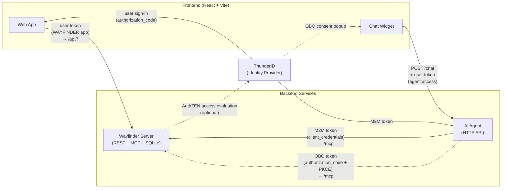

# Wayfinder Sample

End-to-end sample of an AI agent that holds its own ThunderID-managed identity.

The agent uses **its own access token (client_credentials grant)** for browsing tools. When a tool needs the user's consent (booking, cancellation, reading the user's own data), it switches to a **user-context token**. That token is obtained via **OAuth 2.0 authorization-code + PKCE**.

The sample is a travel booking app called Wayfinder. A chat widget in the UI talks to a LangChain agent that calls REST tools through an MCP server. The REST API and the MCP server share one Node process and one set of service modules. `/api/*` is the REST surface and `/mcp` is the MCP surface. REST endpoints enforce scopes from ThunderID-issued tokens. MCP tools use the same scope checks by default and can optionally request runtime decisions from the ThunderID AuthZEN PDP.

## Architecture



### Token Flow

The core chat and booking flow uses two OAuth clients and three token types when AuthZEN mode is enabled:

| Token | OAuth Client | Grant | Purpose |
|-------|-------------|-------|---------|
| **User token** | `WAYFINDER` | `authorization_code` | Frontend sign-in, API calls, chat API auth (`agent:access` scope) |
| **M2M token** | `WAYFINDER-CONCIERGE` | `client_credentials` | Agent's own identity for browsing tools (search flights, hotels) via MCP |
| **OBO token** | `WAYFINDER-CONCIERGE` | `authorization_code` + PKCE | Implicit on-behalf-of user-context token for mutating tools (booking, cancellation) via MCP. Because the client is an agent, the issued token automatically carries an `act` claim identifying the agent. No separate token exchange is needed. |

AuthZEN mode uses the server-level Direct Auth Secret for the backend-to-PDP call instead of an OAuth token.

**How it works:**

1. The user signs in to the Wayfinder web app via the `WAYFINDER` OAuth application. The issued token carries `agent:access` (from the Chat User role).
2. When the user sends a chat message, the frontend calls `POST /chat` on the AI Agent API with the user's access token in the `Authorization` header. The AI Agent validates the token has the `agent:access` scope before processing the message.
3. For browsing tools (search flights, search hotels), the AI Agent uses its own M2M token (obtained via `client_credentials` with the `WAYFINDER-CONCIERGE` credentials) to call the Wayfinder server's `/mcp` endpoint.
4. For mutating tools (create booking, cancel booking), the AI Agent returns a `need_user_consent` response. The frontend opens a consent popup, the user signs in and picks which booking permissions to grant (`booking:read`, `booking:create`, `booking:cancel`), and the authorization code is submitted to `POST /chat/consent`. The agent exchanges it for a user-context token, and the frontend retries the original message. Because `WAYFINDER-CONCIERGE` is a ThunderID *agent*, the issued user-context token automatically includes an `act` claim with the agent's entity ID. This creates an implicit on-behalf-of token. The Wayfinder server logs this delegation (`sub` = the user, `act.sub` = the agent) without any explicit token-exchange step.
5. The Wayfinder server validates the JWT on every request. REST endpoints always enforce token scopes. MCP tools enforce token scopes in the default `scope` mode or send the current user or agent and required permission to the ThunderID PDP in `authzen` mode.

## What This Demonstrates

- A ThunderID **agent** acting as an autonomous principal that is distinct from a ThunderID user.
- The agent's **machine-to-machine (M2M) token** used for read-only browsing tools (search flights, search hotels, recommend flights, etc.).
- **Configurable MCP tool authorization**, so you can compare local token-scope checks with runtime AuthZEN decisions while preserving the same OAuth and agent flows.
- **Scope-based access control** on the AI Agent's HTTP API. Only users with `agent:access` can use the chat. Users without this scope (e.g. `jane.smith`) can browse and book through the UI but cannot use the Wayfinder Concierge.
- A **typed user model** with the `Customer` user type for consumers and the `Staff` user type for internal team. Self sign-up, password recovery, and staff invitation flows back the B2C use-case story.
- An **on-behalf-of (OBO)** flow triggered from inside a chat session: the agent returns a consent request, the frontend opens a popup where the user picks which booking permissions to grant, and the issued user-context token only carries the approved subset. The token is an **implicit OBO token**. It carries an `act` claim naming the agent that mediated the login, so the resource server sees both the user (`sub`) and the acting agent (`act.sub`) from a single token.
- A REST API that **verifies the JWT** and **enforces scopes per route** (`booking:read`, `booking:create`, `booking:cancel`, `booking:recommend`).
- A **self-service profile page** at `/profile` that calls ThunderID's `/users/me` directly with the `WAYFINDER` user token to read account details, edit attributes, and change the password.
- **Multi-LLM support**. The Wayfinder Concierge works with both **Anthropic Claude** and **Google Gemini**, selectable via an environment variable.
- **CIBA-based flight upgrade**. A background upgrade scheduler uses CIBA (Client-Initiated Backchannel Authentication) to authenticate the customer out-of-band via email or SMS notification. The customer approves the upgrade on their own device; the scheduler then processes it with a CIBA-issued token carrying the `upgrade:process` scope.
- **Verifiable Credentials (OID4VCI / OID4VP)**. Members can add a Wayfinder Sky Pass to their EUDI wallet straight from the profile page (OpenID4VCI issuance). The Skyline Lounge kiosk (`lounge/`) verifies the pass using OpenID4VP selective disclosure, reading only the `tier` and `full_name` claims.

## Project Structure

```
wayfinder-sample/
├── frontend/          React + Vite UI. Hosts the chat widget, the
│                      /agent-callback route, and the Sky Pass issuance QR.
├── backend/           Node server backed by SQLite. Hosts both the REST API
│                      (/api/*) and the MCP server (/mcp), validates JWTs,
│                      enforces scopes per route and per MCP tool.
├── smtp-server/       Sample SMTP server with a web inbox UI.
│                      Captures emails sent by ThunderID flows (recovery,
│                      onboarding, CIBA). No external email relay required.
├── ai-agent/          HTTP Wayfinder Concierge API (LangChain + Claude/Gemini).
├── lounge/            Skyline Lounge kiosk. Verifies the Sky Pass via OID4VP
│                      and grants access based on the disclosed tier claim.
├── thunderid-config/  Importable YAML config for ThunderID setup.
└── README.md
```

Each subdirectory has its own README with the environment variables it reads.

## Prerequisites

- Node.js 20+
- A running ThunderID backend on `https://localhost:8090` (self-signed cert is fine).
- **One** of the following LLM API keys:
  - Anthropic API key from [console.anthropic.com](https://console.anthropic.com), **or**
  - Google Gemini API key from [aistudio.google.com](https://aistudio.google.com).

### CORS for the frontend origin

The Wayfinder web app runs on `http://localhost:5173` and calls ThunderID directly for `/oauth2/authorize`, `/oauth2/token`, and `/users/me`. Browsers block these calls unless the CORS allow-list includes the frontend origin.

The importable bundle already adds `http://localhost:5173` to the server-config `cors` section. If you serve the frontend from a different host or port, update the `# resource_type: server_config` document in `thunderid-config/thunderid-config.yaml` before importing, or use `PUT /server-config/cors` after startup.

## ThunderID Setup

The `thunderid-config/redirect/` directory contains an importable YAML that creates all required ThunderID resources, including resource servers, roles, users, the OAuth application, and the AI agent. This is the config for the default redirect-based authentication mode.

> **App-native mode** (embedded sign-in without a Login Gate redirect) is also supported. See [APP_NATIVE.md](APP_NATIVE.md) for setup and try-out instructions.

### Import Resources

Import the bundle:

1. Start ThunderID and open the Console.
2. On the **welcome screen** (shown on first login, or accessible from the user profile menu), choose **Open** and upload `thunderid-config/redirect/thunderid-config.yaml`. Then for environment variables, upload `thunderid-config/redirect/thunderid.env`.

The import creates:

| Resource | Type | What it creates |
|----------|------|-----------------|
| `Customer` | User type | Consumer schema (`username`, `email`, `password`, `given_name`, `family_name`, `mobile_number`, `sub`) with self-registration enabled |
| `Staff` | User type | Internal team schema (`username`, `email`, `password`, `displayName`) |
| `wayfinder-agent` | Resource server | `agent:access` permission |
| `wayfinder` | Resource server | Booking and upgrade permissions, such as `booking:read` and `upgrade:process`. Protects both `/api/*` (REST) and `/mcp` (MCP tools) on the Wayfinder server. |
| `WAYFINDER` | Application | Public OAuth app (PKCE, redirect to `http://localhost:5173`) with registration and recovery flows enabled |
| `WAYFINDER-CONCIERGE` | Agent | Confidential OAuth client with `client_credentials` + `authorization_code` grants |
| `WAYFINDER-UPGRADE-AGENT` | Agent | CIBA-only confidential client used by the upgrade scheduler to authenticate customers out-of-band |
| `wayfinder-registration-flow` | Flow | Self sign-up flow (REGISTRATION). Assigns the `Traveler` role on completion. |
| `wayfinder-recovery-flow` | Flow | Email-link password recovery flow (RECOVERY) |
| `wayfinder-onboarding-flow` | Flow | Staff onboarding flow (USER_ONBOARDING) with Support/DestinationsAdmin role-selection branches |
| `wayfinder-agent-auth-flow` | Flow | Authentication flow with consent screen (assigned to the AI chat agent) |
| `wayfinder-ciba-email-flow` | Flow | CIBA authentication flow that notifies the user via email (used by the upgrade scheduler by default) |
| `wayfinder-ciba-sms-flow` | Flow | CIBA authentication flow that notifies the user via SMS (switch to this in Console to try the SMS channel) |
| `Traveler` | Role | Booking permissions, assigned to `john.doe` and `jane.smith` |
| `Support` | Role | Staff role for consumer support workflows |
| `DestinationsAdmin` | Role | Staff role for curating featured destinations |
| `OpsAdmin` | Role | Staff role for managing other staff, assigned to `alex.carter` |
| `Wayfinder Chat User` | Role | `agent:access`, `booking:upgrade`, and `upgrade:process` permissions, assigned to `john.doe` |
| `Recommender` | Role | `booking:recommend` and `upgrade:search` permissions, assigned to the Wayfinder Concierge |
| `Upgrade Scheduler` | Role | `upgrade:read` and `upgrade:search` permissions, assigned to the upgrade scheduler agent |
| `john.doe` / `john.doe` | User | Demo user with Concierge access, booking, and upgrade permissions |
| `jane.smith` / `jane.smith` | User | Demo user with booking permissions but **no** Concierge access |
| `alex.carter` / `alex.carter` | User | Staff with the `OpsAdmin` role for inviting other staff |

The agent's client secret defaults to `wayfinder-agent-secret` (set in `thunderid.env`). Change it in the environment file before importing if you prefer a different value.

### Environment variables in `redirect/thunderid.env`

| Variable | Required | Description |
|---|---|---|
| `WAYFINDER_CLIENT_ID` | Yes | Client ID for the `WAYFINDER` application |
| `AGENT_CLIENT_ID` | Yes | Client ID for the `WAYFINDER-CONCIERGE` agent |
| `AGENT_CLIENT_SECRET` | Yes | Client secret for the Wayfinder Concierge |
| `UPGRADE_AGENT_CLIENT_ID` | Yes | Client ID for the `WAYFINDER-UPGRADE-AGENT` |
| `UPGRADE_AGENT_CLIENT_SECRET` | Yes | Client secret for the upgrade scheduler agent |
| `JOHN_DOE_PASSWORD` | Yes | Password for the `john.doe` demo user |
| `JANE_SMITH_PASSWORD` | Yes | Password for the `jane.smith` demo user |
| `ALEX_CARTER_PASSWORD` | Yes | Password for the `alex.carter` demo user |
| `CIBA_LOGIN_HINT_ATTRIBUTE` | Yes | Attribute used by the CIBA flow's `IdentifyingExecutor` to resolve the login hint to a user. Set to `email` (default) when using `login_hint`, or `userID` when using `id_token_hint`. |
| `SMS_SENDER_ID` | **SMS only** | Notification sender ID for the CIBA SMS flow. Required only if you switch the upgrade agent to `wayfinder-ciba-sms-flow`. Obtain the sender ID after completing the [SMS setup](#sms-notifications-optional) in Manual Setup. |

### Manual Setup

After the import, update `deployment.yaml` with three additions and restart the server:

- Activate the Wayfinder onboarding flow. ThunderID permits only one `USER_ONBOARDING` flow at a time, selected by handle:

  ```yaml
  flow:
    user_onboarding_flow_handle: "wayfinder-onboarding-flow"
  ```

- Configure SMTP so recovery and invitation emails can be delivered. The sample ships with a built-in local SMTP server (`smtp-server/`) that listens on `127.0.0.1:2525`. No external relay is required. The defaults below match its credentials exactly, so no further editing is needed for local development:

  ```yaml
  email:
    smtp:
      host: "127.0.0.1"
      port: 2525
      username: "dev"
      password: "dev"
      from_address: "noreply@thunderid.dev"
      enable_start_tls: false
      enable_authentication: true
  ```

  Once the sample is running, open `http://localhost:8788` to view captured emails in the inbox UI.

- Configure the Direct Auth Secret used by AuthZEN mode:

  ```yaml
  server:
    security:
      direct_auth_secret: "wayfinder-direct-auth-secret"
  ```

#### SMS Notifications (Optional)

ThunderID can deliver notifications, including CIBA upgrade approvals, via SMS in addition to email. To use SMS:

1. Register an SMS notification sender via the ThunderID API:

   ```bash
   POST https://localhost:8090/notification-senders/message
   ```

   Pass your SMS provider credentials in the request body. Copy the returned sender `id` into `thunderid-config/thunderid.env`:

   ```env
   SMS_SENDER_ID=<sender-id-from-api>
   ```

   Re-import `thunderid-config/redirect/thunderid-config.yaml` so the CIBA SMS flow picks up the new sender.

2. In the ThunderID Console, go to **Applications → WAYFINDER-UPGRADE-AGENT** and change the Authentication Flow to `wayfinder-ciba-sms-flow`. Save.

3. Update `john.doe`'s `mobile_number` field in the Console (E.164 format, for example `+15550101`).

Notifications now arrive as SMS. If you already approved the consent during the email flow, the consent screen is skipped on future approvals.

## Configure the Sample

`backend/`, `smtp-server/`, `ai-agent/`, and `frontend/` each ship with a `.env.example` listing only the variables you actually need to set. In each of those folders, copy it to `.env` and fill the placeholders. The `smtp-server/.env.example` defaults already match the `email.smtp` settings in `deployment.yaml`, so it works as-is.

The only placeholder you must replace is in `ai-agent/.env`:

- `ANTHROPIC_API_KEY=` (or `GOOGLE_API_KEY=`), your LLM API key.

The agent secret defaults to `wayfinder-agent-secret` (matching `thunderid.env`). Everything else in the examples is local development defaults that match the run instructions below.

### MCP Tool Authorization

The Wayfinder backend supports two MCP tool authorization modes. Scope-based authorization remains the default:

```env
AUTHORIZATION_MODE=scope
```

In this mode, each protected tool checks its required permission in the incoming access token.

To request runtime decisions from the ThunderID AuthZEN PDP, configure `backend/.env` as follows and restart the
backend:

```env
AUTHORIZATION_MODE=authzen
THUNDERID_DIRECT_AUTH_SECRET=wayfinder-direct-auth-secret
```

The backend sends this value in the `Direct-Auth-Secret` header when it calls the AuthZEN PDP. This secret authenticates
the PDP request; it is not the authorization subject. The user or agent identified by the incoming MCP token remains the
subject whose role assignments determine the decision.

For example, `recommend_bookings` evaluates:

```json
{
  "subject": {
    "id": "wayfinder-concierge"
  },
  "resource": {
    "type": "http://localhost:8787/mcp"
  },
  "action": {
    "name": "booking:recommend"
  }
}
```

Only MCP tools with a configured permission call the PDP. Public browsing tools remain permission-free. REST
endpoints continue to enforce scopes, and `/chat` continues to require `agent:access` in both modes. PDP errors, missing
decisions, and denied decisions fail closed.

### Upgrade Scheduler

The background scheduler that processes CIBA upgrade requests is **disabled by default**. Enable it only after the CIBA email (or SMS) flow is configured in ThunderID and the upgrade agent credentials are set:

| Variable | Default | Description |
|---|---|---|
| `UPGRADE_SCHEDULER_ENABLED` | `false` | Set to `true` to start the scheduler. When disabled the agent starts normally but no CIBA polls are made. |
| `CIBA_HINT_TYPE` | `login_hint` | Hint type sent to `bc-authorize`. `login_hint` uses the user's email address; `id_token_hint` uses the user's OIDC ID token stored at upgrade-request time. Changing this also requires updating `CIBA_LOGIN_HINT_ATTRIBUTE` in `thunderid-config/thunderid.env` and re-importing the ThunderID config. |

## Run

From the sample root, install all workspace dependencies:

```bash
cd backend     && npm install && npm run seed && npm start   # http://localhost:8787 (REST + /mcp)
cd smtp-server && npm install && npm run dev                 # SMTP :2525 | Inbox http://localhost:8788
cd ai-agent    && npm install && npm start                   # http://localhost:8790/chat
cd frontend    && npm install && npm run dev                 # http://localhost:5173
```

The Wayfinder server hosts both the REST API on `/api/*` and the MCP server on `/mcp`. `npm run seed` initializes the local SQLite database with sample flights, hotels, and trips. Run it once on first setup.

The SMTP server captures all emails sent by ThunderID (password recovery, staff invitations, CIBA upgrade notifications) and displays them at `http://localhost:8788`. It accepts any username/password, matching the `deployment.yaml` defaults (`dev` / `dev`).

## Try It

Open `http://localhost:5173`, sign in as `john.doe` / `john.doe`, open the chat widget, and try:

```
What flights are there from Colombo to Singapore?
```

These browsing tools use the agent's M2M token. No popup appears beyond the initial sign-in.

You can also ask the agent for general recommendations. For example:

```
Suggest a few flight deals.
```

This calls the `recommend_bookings` MCP tool, which serves `GET /api/bookings/recommended` from the same service module with the agent's M2M token. The tool requires the `booking:recommend` permission, which is granted to the `WAYFINDER-CONCIERGE` agent via its **Recommender** role assignment.

Then:

```
Book flight 2
```

The agent will pause and ask for your permission. A popup opens and you sign in as the demo user via the agent's OAuth application. You pick which booking permissions to grant in the consent screen. The booking then succeeds, or returns 403 if you denied `booking:create`.

### Verify AuthZEN Decisions

With `AUTHORIZATION_MODE=authzen`, ask the Concierge for recommendations and inspect the Wayfinder backend log:

```text
[authzen] ALLOW subject=wayfinder-concierge resource=http://localhost:8787/mcp action=booking:recommend
```

Calling `recommend_bookings` directly as `john.doe` through MCP Inspector is denied because the **Recommender** role is
assigned to the Concierge agent, not John:

```text
[authzen] DENY subject=wayfinder-john-doe resource=http://localhost:8787/mcp action=booking:recommend
```

### Manage Your Profile

Click your name in the top-right corner and pick **Profile** to view your account details, edit profile attributes, or change your password. The page calls ThunderID's `/users/me`, `PUT /users/me`, and `POST /users/me/update-credentials` directly with the `WAYFINDER` user token. No scope beyond a valid user JWT is required.

### No Chat Access

Sign out and sign in as `jane.smith` / `jane.smith`. Jane can browse flights, hotels, and manage bookings through the web UI. Sending a chat message returns a 403 error because her token lacks the `agent:access` scope. She is not assigned the **Chat User** role.

### Flight Upgrade via CIBA

The Wayfinder Concierge supports requesting cabin upgrades. The upgrade is processed asynchronously by a background scheduler that authenticates the customer out-of-band using **CIBA (Client-Initiated Backchannel Authentication)**.

**Before trying this feature:**

1. Set `UPGRADE_SCHEDULER_ENABLED=true` in `ai-agent/.env` and restart the agent. The scheduler is disabled by default.
2. Update `john.doe`'s profile in the ThunderID Console with a real email address. The CIBA notification is delivered there.

Sign in as `john.doe` and try:

```
What flights are available from Colombo to Singapore?
Book flight-cmb-sin-01 for 1 traveler
I want to upgrade my Colombo to Singapore booking to business class. What are my options?
Upgrade my booking to flight-cmb-sin-01-biz
```

The agent submits the upgrade request and tells you that a notification will be sent. Make sure the scheduler is running (`UPGRADE_SCHEDULER_ENABLED=true`). Within 30 seconds it picks up the request and emails you an approval link. Open the link, enter your password, approve the consent screen (first time only), and the upgrade is processed automatically.

Sign back in and ask:

```
Check my bookings
```

The booking now shows Business class.

### Demo Scripts

Helper scripts in `scripts/` let you reset and control demo state without going through the UI.

| Script | What it does |
|---|---|
| `scripts/business-class.sh lock` | Makes all Business class flights **unavailable**, so every upgrade request requires CIBA approval. Run this to reset the demo to its default state or to force the CIBA flow on demand. |
| `scripts/business-class.sh unlock` | Makes all Business class flights **available** again. Run this after the upgrade is processed to restore normal availability. |
| `scripts/trigger-upgrade.sh` | Triggers one CIBA upgrade cycle on the agent directly, without touching flight availability. Use this to drive the upgrade flow manually step by step, or instead of enabling the full scheduler loop. |

**Typical try-out flow:**

```bash
# 1. Lock Business class so upgrades require CIBA approval
./scripts/business-class.sh lock

# 2. Ask the agent to upgrade a booking — it will initiate CIBA and pause
# 3. Approve the notification (email or SMS link)

# 4. Trigger upgrade processing
./scripts/trigger-upgrade.sh

# 5. Unlock Business class
./scripts/business-class.sh unlock

# 6. Ask the agent to check your bookings — it now shows Business class
```

Set `WAYFINDER_BACKEND_URL` and `WAYFINDER_AGENT_URL` to override the default `http://localhost:8787` / `http://localhost:8790` endpoints if your services run on different ports.

---

## CIBA Backchannel Authentication

The Wayfinder sample includes an optional upgrade scheduler that demonstrates CIBA (Client-Initiated Backchannel Authentication). A background agent authenticates users out-of-band via email notification, without any browser session. For the protocol reference, see [Backchannel Authentication (CIBA)](https://thunderid.dev/docs/next/guides/guides/protocols/oauth-oidc/backchannel-authentication) in the ThunderID documentation.

### Try It Out

1. Lock Business class to force CIBA approval on upgrade requests:

   ```bash
   ./scripts/business-class.sh lock
   ```

2. Sign in as `john.doe` and ask the Wayfinder Concierge to book and then upgrade a flight. The agent submits the request and tells you a notification will be sent.

3. Trigger one CIBA upgrade cycle manually:

   ```bash
   ./scripts/trigger-upgrade.sh
   ```

4. Open `http://localhost:8788`, find the approval email, follow the link, enter `john.doe`'s password, and approve.

5. Run `trigger-upgrade.sh` once more to complete the upgrade.

6. Unlock Business class and confirm the booking shows Business class:

   ```bash
   ./scripts/business-class.sh unlock
   ```

To run the scheduler automatically instead, set `UPGRADE_SCHEDULER_ENABLED=true` in `ai-agent/.env` and restart the agent.
