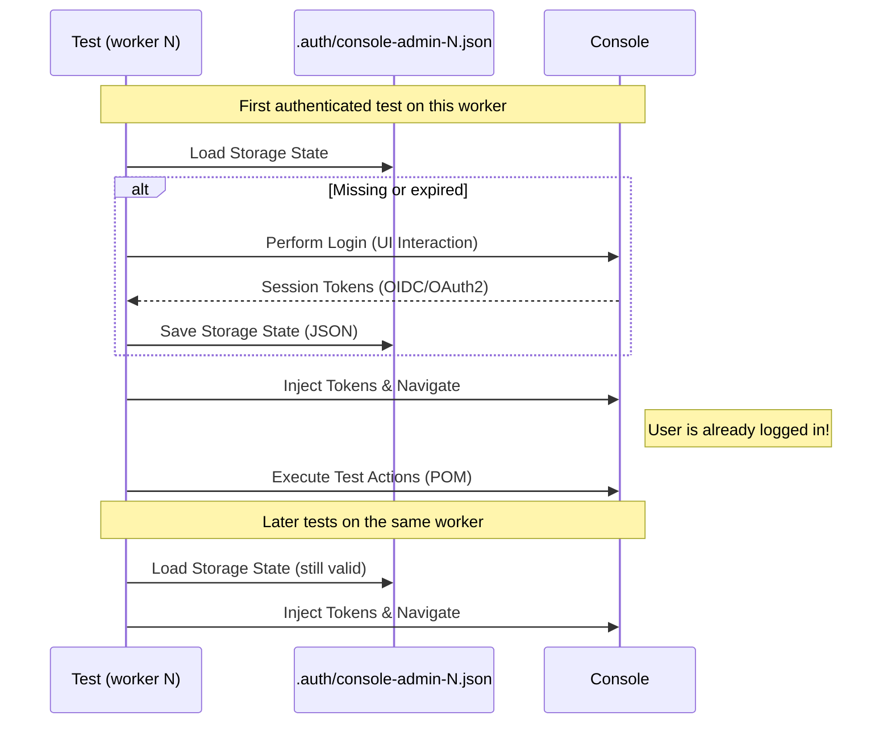

# ThunderID Console E2E Tests

End-to-end automation test suite for the Console, built with [Playwright](https://playwright.dev/).

## 📋 Overview

This framework uses the **Page Object Model (POM)** design pattern and a per-worker authentication fixture to handle login efficiently.

### Key Features

- **Per-Worker Authentication**: Each test worker logs in on first use and reuses its own session state for the rest of its tests. This is deliberate, not just an optimization: the backend rotates refresh tokens and revokes the whole token family if a used one is replayed, so workers cannot share a single login without racing each other's silent token refresh.
- **Cross-Browser Support**: Configured for Chromium, Firefox, and WebKit (Safari).
- **Token-Based Auth Support**: Specialized utilities to capture and inject OIDC/OAuth2 tokens for the ThunderID backend.
- **Robustness**: Auto-retry logic, network idle waits, and intelligent locator handling.
- **CI/CD Friendly**: Includes a GitHub Actions workflow that maps repository secrets/variables (e.g., `PLAYWRIGHT_BASE_URL`, `PLAYWRIGHT_ADMIN_PASSWORD`) to test environment variables. Refer to the workflow file for the complete list of required configurations.

---

## 🚀 Getting Started

### Prerequisites

- Node.js (LTS version recommended)
- NPM

### Installation

1. Navigate to the e2e directory:
   ```bash
   cd <PROJECT_ROOT>/tests/e2e
   ```
2. Install dependencies:
   ```bash
   npm ci
   ```
3. Install Playwright browsers:
   ```bash
   npx playwright install --with-deps
   ```

### Build the Product

From the repository root, build the product if you haven't already:

```bash
make build
```

This produces the server distribution and sample app packages under `target/dist/`.

### Start the Server

Extract the server distribution, run setup (which bootstraps default resources and registers sample app OAuth clients), then start the server:

```bash
mkdir -p tests/e2e/server
unzip "target/dist/thunderid-*.zip" -d tests/e2e/server
cd tests/e2e/server && ./setup.sh
./start.sh &
```

### Extract Sample Apps and Start the SDK Sample

Extract both sample packages and start the React SDK sample app, which the e2e tests interact with:

```bash
cd <REPO_ROOT>
mkdir -p tests/e2e/sample-app-vanilla tests/e2e/sample-app-sdk

unzip "target/dist/sample-app-vanilla-*.zip"      -d tests/e2e/sample-app-vanilla
unzip "target/dist/sample-app-react-sdk-*.zip"    -d tests/e2e/sample-app-sdk

cd tests/e2e/sample-app-sdk && ./start.sh &
```

### Configuration

`run-e2e.sh` auto-generates a working `.env` from [`defaults.env`](defaults.env) - the canonical fixed dataset also used by CI on first run, so you normally don't need to create one by hand.

To override specific values (e.g. a different server or different test credentials), copy
`.env.example` to `.env` and uncomment what you need:

```bash
cp .env.example .env
```

The Wayfinder AI agent tryout tests (`tests/wayfinder/ai-agent-tryout/**`) additionally need a real
LLM API key. Set it here, along with the provider and model the agent should use:

| Value          | Purpose                                                              |
| :------------- | :------------------------------------------------------------------- |
| `LLM_API_KEY`  | API key for the provider. Required; nothing else here has any effect without it. |
| `LLM_PROVIDER` | `anthropic` (default) or `google`.                                   |
| `MODEL_NAME`   | Model override. Leave unset to use the provider's default model.     |

`run-e2e.sh` writes all three into `samples/apps/wayfinder-sample/ai-agent/.env`, overwriting any
values already there, then imports the Wayfinder config bundle and starts the Wayfinder backend and
AI agent for phase 2. Without a key none of that happens and the agent tests are skipped; the rest
of phase 2 runs as usual, with `wayfinder-sample-setup.spec.ts` importing the bundle through the
console UI later on.

---

## 🛠 CI/CD Configuration

The GitHub Actions workflow is designed to work with repository **Secrets** and **Variables**. The suite uses a priority system: **Secret > Variable > [`defaults.env`](defaults.env)** (the same fixed dataset `run-e2e.sh` uses locally).

### Required GitHub Settings

To customize the CI environment, add the following to **Settings > Secrets and variables > Actions**:

| Name                            | Type       | Purpose             | Fallback                 |
| :------------------------------ | :--------- | :------------------ | :----------------------- |
| `PLAYWRIGHT_BASE_URL`           | Variable   | App URL             | `https://localhost:8090` |
| `PLAYWRIGHT_ADMIN_USERNAME`     | Variable   | Admin Login         | `admin`                  |
| `PLAYWRIGHT_ADMIN_PASSWORD`     | **Secret** | Admin Password      | `admin`                  |
| `PLAYWRIGHT_TEST_USER_USERNAME` | Variable   | Test User Login     | `testuser`               |
| `PLAYWRIGHT_TEST_USER_PASSWORD` | **Secret** | Test User Password  | `admin`                  |
| `PLAYWRIGHT_WORKERS`            | Variable   | Parallel Processing | `6`                      |
| `PLAYWRIGHT_DEBUG_AUTH`         | Variable   | Auth Debug Logs     | `false`                  |
| `PLAYWRIGHT_LLM_API_KEY`        | **Secret** | Wayfinder AI agent LLM key | _none - agent tests skip_ |
| `PLAYWRIGHT_LLM_PROVIDER`       | Variable   | LLM provider        | `anthropic`              |
| `PLAYWRIGHT_LLM_MODEL_NAME`     | Variable   | LLM model override  | provider default         |

CI runs the suite in two phases against two independently provisioned servers: everything except the `@wayfinder`-tagged tests first, then the Wayfinder tests alone against a fresh server with its own sample app and mock SMTP inbox. `run-e2e.sh` reproduces both phases locally (see its `--phase` flag).

The AI agent tryout tests are gated on `PLAYWRIGHT_LLM_API_KEY` in the same way as locally: the workflow only imports the Wayfinder config bundle and starts the Wayfinder backend and AI agent when that secret is set. Forked pull requests receive no secrets, so those tests skip there and no LLM calls are billed.

---

## 🏃‍♂️ Running Tests

### Standard Commands

| Command                 | Description                                                          |
| ----------------------- | -------------------------------------------------------------------- |
| `npm test`              | Run all tests on all configured browsers (Chromium, Firefox, WebKit) |
| `npm run test:chromium` | Run tests on Google Chrome/Chromium only                             |
| `npm run test:firefox`  | Run tests on Firefox only                                            |
| `npm run test:webkit`   | Run tests on Safari/WebKit only                                      |
| `npm run test:headed`   | Run tests with browser visible (headed mode)                         |
| `npm run test:debug`    | Run tests in debug mode with Playwright Inspector                    |
| `npm run test:trace`    | Run tests with tracing enabled for debugging                         |
| `npm run ui`            | Open Playwright's interactive UI mode (Debugging)                    |
| `npm run report`        | Open the HTML test report                                            |

### Code Quality Commands

| Command                | Description                         |
| ---------------------- | ----------------------------------- |
| `npm run lint`         | Check code for linting errors       |
| `npm run lint:fix`     | Automatically fix linting errors    |
| `npm run format`       | Format code with Prettier           |
| `npm run format:check` | Check if code is properly formatted |
| `npm run type-check`   | Run TypeScript type checking        |

### Running Specific Tests

```bash
# Run tests with specific tag
npx playwright test --grep @smoke

# Run tests in specific file
npx playwright test tests/user-management/user-creation.spec.ts

# Run specific test by name
npx playwright test -g "TC001"

# Run tests excluding specific tag
npx playwright test --grep-invert @slow
```

### Report Merging

When running tests in parallel or CI, reports are generated as blobs. To merge them into a single HTML report:

```bash
npm run posttest
```

---

## 🏗️ Architecture & Design

### Authentication Flow

There is no dedicated login project. The `authenticatedPage` fixture (`console-admin-auth-utils.ts`) checks a per-worker session file on each test's first use: if it's missing or the token looks expired, it performs an inline login and saves the result; otherwise it reuses the saved state. The file is keyed by `TEST_PARALLEL_INDEX`, so each worker maintains its own session and never shares a refresh token with another worker.



### Directory Structure

```plaintext
tests/e2e/
├── configs/
│   ├── routes/           # UI Route definitions
│   └── api/              # API Route definitions
├── constants/            # Static constants
│   ├── http-status.ts    # HTTP Status codes
│   └── ui-messages.ts    # UI text/labels
├── data/                 # Test Data Factories
│   └── test-data.ts      # Dynamic data generators
├── fixtures/             # Playwright Fixtures
│   └── console/          # Console specific fixtures
│       ├── console-auth.fixture.ts
│       └── console-pom.fixture.ts
├── pages/                # Page Object Models
├── tests/                # Test Specs
├── utils/                # Helper functions
├── playwright.config.ts  # Main configuration
└── package.json
```

---

## ✍️ Writing New Tests (Best Practices)

Follow this workflow when adding new automation:

### Step 1: Define Constants and Configurations

Before writing test logic, define static values in the appropriate files:

- **Routes**: Add UI paths to `configs/routes/console-routes.ts`.
- **API Endpoints**: Add API paths to `configs/api/console-api-routes.ts`.
- **UI Messages**: Add static text (labels, headers, success messages) to `constants/ui-messages.ts`.
- **Status Codes**: Use `constants/http-status.ts` for response verification.

### Step 2: Create Test Data

Avoid hardcoding data in tests. Use `data/test-data.ts` to generate dynamic data:

```typescript
import { TestData } from "../../data/test-data";
const newUser = TestData.user("myfeature");
```

### Step 3: Create Page Object Model (POM)

Create a new file in `pages/<feature>/`.

- Use **data-testid** selectors where possible for robustness (`page.getByTestId(...)`).
- Encapsulate all locators and actions within the class.
- Do not put assertions in the POM unless checking page load state.

```typescript
export class MyFeaturePage {
  constructor(readonly page: Page) {}

  // Locators
  readonly submitBtn = this.page.getByTestId("submit-btn");

  // Actions
  async submit() {
    await this.submitBtn.click();
  }
}
```

### Step 4: Register Fixture

Add your new POM to `fixtures/console-pom.fixture.ts`:

```typescript
import { MyFeaturePage } from "../pages/my-feature";

type POMFixtures = {
  myFeaturePage: MyFeaturePage;
};

export const test = base.extend<POMFixtures>({
  myFeaturePage: async ({ authenticatedPage }, use) => {
    // Automatically injects authenticated page
    await use(new MyFeaturePage(authenticatedPage));
  },
});
```

### Step 5: Write the Test Spec

Create your spec file in `tests/<feature>/`. ALWAYS import `test` and `expect` from `../../fixtures`.

```typescript
import { test, expect } from "../../fixtures";
import { UIMessages } from "../../constants/ui-messages";

test("verify feature works", async ({ myFeaturePage }) => {
  await myFeaturePage.goto();
  await myFeaturePage.submit();

  await expect(myFeaturePage.page.getByText(UIMessages.common.save)).toBeVisible();
});
```

---

## 🔧 Troubleshooting

- **"Tokens expired"**: The framework handles this automatically via `console-admin-auth-utils.ts`. It detects expired tokens and performs an inline login if necessary.
